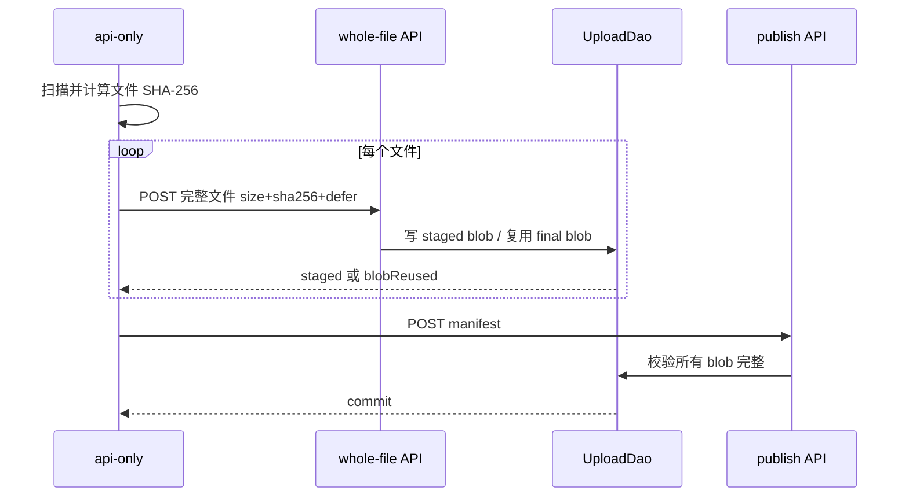
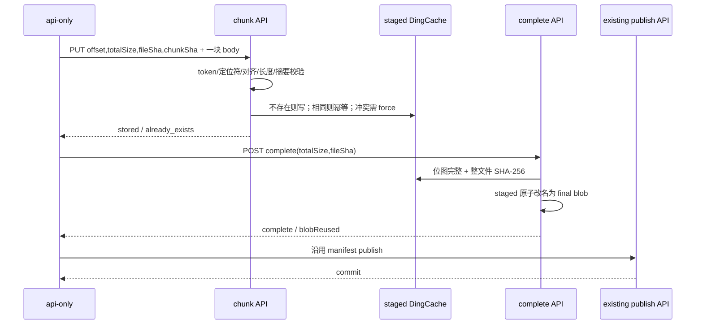

# 02. 现有与目标主线

> 阅读路径：← [项目地图](01-project-map.md) · [首页](README.md) · [下一步](03-important-branches.md)

## 主线 A：现有多文件上传

用户选择一个目录；api-only 逐文件 hash，逐文件调用 `defer=true` 完整上传，全部成功后提交一份 manifest。

- **[已验证]** `defer=true` 不触碰版本清单，只 materialize blob，见 [UploadWholeFile deferred branch](../../internal/dao/upload_dao.go#L201-L219)。
- **[已验证]** publish 先确认每个 blob 完整和 size 相符，再合并 manifest，见 [verifyPublishContent](../../internal/dao/upload_dao.go#L352-L389)。

## 为什么现有 `start` 不能直接承载单块

现有续传请求的 `size` 是**整文件大小**。`writeBodyToDingCache` 从 `start` 循环读取，直到 `total == declaredSize`；若请求只带一个非末尾块，下一次 `io.ReadFull` 会返回 EOF，最终得到 `UPLOAD_INVALID_CONTENT`。见 [writeBodyToDingCache](../../internal/dao/upload_dao.go#L609-L643)，`internal/dao/upload_dao.go:609-643`。

此外，`start` 必须严格等于服务端计算的第一个缺失块偏移，因此它支持顺序续传，不支持任意块、重发旧块或乱序并行。见 [resume offset validation](../../internal/dao/upload_dao.go#L530-L545)，`internal/dao/upload_dao.go:530-545`。

## 主线 B：推荐的分块上传

### 成功结果

每个 HTTP 请求最多携带一个服务端块；任意请求失败只影响该整文件 SHA 对应的 staged blob。只有 `complete` 成功后内容才成为可发布 blob，只有现有 publish 成功后 revision 才对下载者可见。

### 建议请求契约

`PUT /api/local-upload-chunk/:repoType/:org/:repo/:revision/*`

查询参数：`size`（整文件）、`sha256`（整文件）、`offset`、`chunkSize`、`chunkSha256`、可选 `force=true`、保持 `defer=true` 或直接规定 chunk 永远 deferred。HTTP `Content-Length` 必须等于 `chunkSize`。

`POST /api/local-upload-complete/:repoType/:org/:repo/:revision/*?size=&sha256=`

complete 不接收模型 body，只做位图、size、整文件 hash 和原子改名。之后复用现有 `/api/local-publish/...`。

