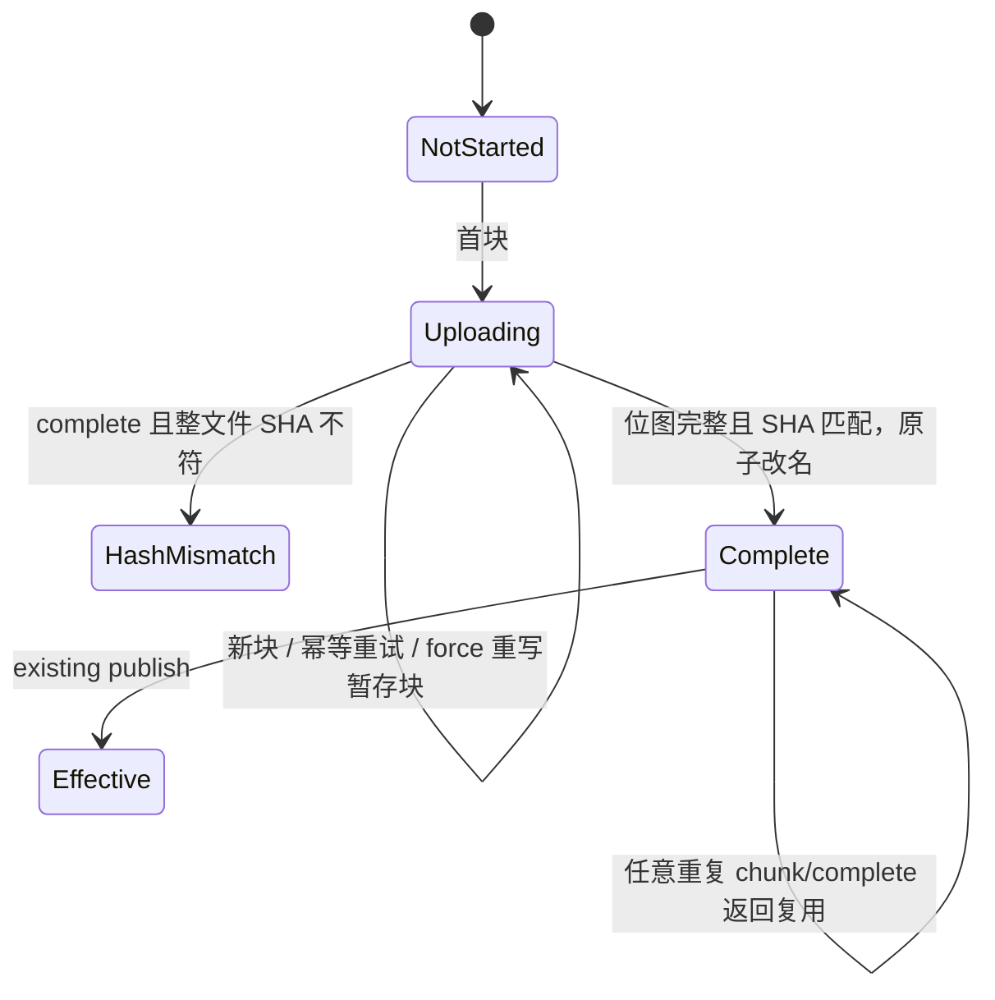

# 05. 架构分析与实施建议

> 阅读路径：← [关键代码](04-key-code.md) · [首页](README.md) · [下一步](06-glossary-and-open-questions.md)

## 可行性判断

- **[已验证]** 当前代码已经具备随机块写、块位图、暂存文件、整文件校验、原子改名和批量发布边界。
- **[推断]** 在这些原语上增加独立 chunk/complete 协议，不需要重写存储格式或发布算法；主要风险集中在协议校验、并发锁和接线回归。
- **[待确认]** 性能收益、最佳块大小和共享 repos 的多进程部署形态，需要 PoC、压测和部署核查后才能定稿。

| 维度 | 判断 | 原因 |
|---|---|---|
| 物理随机块写 | 高 | DingCache 已支持 `HasBlock/WriteBlock` 与位图 |
| 协议改造 | 中 | 现有 `start→EOF` 语义不能复用为单块，需要新端点/方法 |
| 与批量发布兼容 | 高 | chunk 只 materialize blob，现有 publish 可原样复用 |
| 运行时隔离 | 高 | 上传已有独立 8091 server；新增路由可默认关闭 |
| 开发期“写坏不影响其他代码” | 有条件 | worktree/分支可保护运行基线；同一构建中的编译错误无法被开关隔离 |
| 多进程并发写 | 低/待扩展 | 当前 blob/revision keyed locks 是进程内锁 |

## 推荐架构：并列协议，不扩写旧语义

不推荐给现有 `/api/local-upload` 增加一组互斥参数并在内部切换 whole/chunk 语义。那会让最关键的旧入口拥有更多分支，参数组合爆炸，也增加回归风险。

推荐：

- 旧：`POST local-upload`（完整/从断点到 EOF）保持原样。
- 新：`PUT local-upload-chunk`（恰好一个物理块）。
- 新：`POST local-upload-complete`（位图 + 整体 SHA + rename）。
- 旧：`POST local-publish` 保持原样。

## 服务端状态机

`HashMismatch` 不应自动删除 staged blob，便于定点 force 修复；但需沿用 staging retention 清理。API 应返回缺失块或首个缺失偏移，避免 api-only 重传全部。

## 分阶段施工（每阶段都可停）

### 阶段 0：冻结基线

- 新建独立 worktree/分支；记录两个仓库 SHA 与 dirty 文件。
- 保存当前通过的目标包测试结果；构建并保留当前可运行二进制。
- 不修改当前运行实例使用的目录、配置与二进制。

### 阶段 1：纯核心能力，不接生产入口

- 新增 chunk 参数校验器、状态 DTO、DAO 的 `PutChunk/CompleteBlob`。
- 只使用临时 repos 目录做单测；不注册路由，不改 wire。
- 覆盖：首/中/末块、空文件、缺块、错位、短/长 body、chunk hash、整文件 hash、重复、force、final immutable、并发、配置变化后续传。

此阶段即使逻辑有 bug，旧运行二进制与旧路由均不受影响；若代码编译失败，只影响实验 worktree 的构建。

### 阶段 2：HTTP 入口，默认关闭

- 新 handler/router，配置 `upload.chunk.enabled: false`。
- 验证关闭时新路由 404、旧三路由响应逐字段不变。
- 增加请求体上限、Content-Length 与错误码契约测试。

### 阶段 3：api-only 可选客户端

- `DingoClient` 增加能力接口或独立 `ChunkDingoClient`，不要强迫旧 fake/mock 一次性实现新方法。
- api-only 配置 `DINGOSPEED_CHUNK_UPLOAD=false` 默认走旧 `StageFile`；开启才执行 chunk/complete。
- 任务状态可先保持文件级，不必立即改 Console；块级进度仅用于内部重试。

### 阶段 4：灰度与回滚

- 先部署 dingospeed（开关关闭），跑旧 E2E。
- 开 dingospeed 新路由，仅测试专用 api-only 开 chunk；其他调用方继续旧协议。
- 验证同一目录走旧/新两条路径得到相同 manifest、commit、下载字节与 SHA。
- 回滚顺序：先关 api-only chunk，回到旧 StageFile；再关 dingospeed 路由；必要时回滚二进制。staged chunk 文件不对 revision 可见，可由既有 retention 回收。

## 必须设为合并门禁的测试

1. 现有 dingospeed 四个目标包测试零回归。
2. spinfield `internal/modelupload` 旧路径测试零回归。
3. 新旧上传同一模型的最终 commit、manifest、下载内容逐字节相同。
4. `enabled=false` 时路由表和旧响应不变。
5. final blob 在任何 `force` 请求下不可改变。
6. 故障注入：任一块请求中断、complete 前崩溃、complete hash 失败、publish 失败，都不能改变当前 revision。

## 不建议做的两件事

- 不要让 api-only 直接计算 `blockIndex` 后要求 DAO 无条件 `WriteBlock`；HTTP 边界必须重做所有校验。
- 不要在第一个版本追求乱序高并发。先支持顺序逐块 + 任意块幂等重试，确认磁盘/锁/header 写放大后再开放窗口并发。
