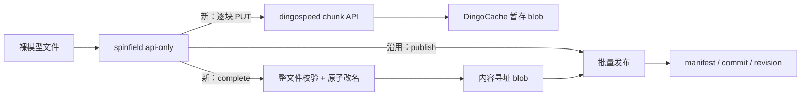

# 分块上传可行性研究

> 阅读路径：[下一步：项目地图](01-project-map.md)

## 结论

方案**可行，但不能把 api-only 切出的单块直接提交给现有 `start` 接口**。现有接口把 `size` 解释为完整文件大小，把 `start` 解释为“从该偏移连续上传到文件末尾”；单块请求会被判定为请求体过短。推荐保留现有完整/续传/批量发布协议原样，新增一组默认关闭的 `chunk → complete → publish` 能力。

最重要的设计约束：

- chunk 请求只写按整文件 SHA 寻址的**暂存 blob**，不改 revision/manifest；仍由现有 publish 一次生效。
- 服务端拥有块规则。api-only 可以配置期望块大小，但 dingospeed 必须按服务端配置或既有暂存文件头校验，不能相信客户端参数。
- `force` 只允许覆盖暂存块，绝不覆盖已经完成并原子发布的内容寻址 blob。
- 已有块不能仅凭位图盲目跳过；至少比较 `chunkSha256`，相同才幂等成功，不同返回冲突，显式 `force=true` 才重写。
- 开发隔离采用“新包/新方法先落地、默认关闭、最后接路由”；编译失败无法靠 feature flag 隔离，因此还需独立分支/worktree 与 CI 合并门禁。

## 研究基线

| 项目 | 基线 |
|---|---|
| dingospeed | `batch-file-upload` / `e2d3b250f590c4f1a4e9a8fe46689b72ab269b80`；`config/config.yaml` 有用户未提交修改，未改业务代码 |
| spinfield api-only | `main` / `38fb27a4b99144c09ced8dd9017fa604b29275a1`；模型上传/API-only 为工作区未提交在研实现 |
| 研究时间 | 2026-08-13，Asia/Shanghai |
| 验证 | `go test ./internal/handler ./internal/service ./internal/dao ./internal/downloader`；`go test ./internal/modelupload`，均通过 |

## 系统概览

## 阅读顺序

1. [项目地图](01-project-map.md)
2. [现有与目标主线](02-mainline.md)
3. [兼容、幂等、并发、隔离支线](03-important-branches.md)
4. [关键代码](04-key-code.md)
5. [方案与分阶段实施](05-architecture-analysis.md)
6. [术语、待确认项](06-glossary-and-open-questions.md)

## 可信度

- **[已验证]** dingospeed 现有 HTTP、校验、落盘、发布链路与相关单测。
- **[已验证/工作区]** spinfield api-only 当前逐文件 hash、stage、publish 链路。
- **[推断]** 新协议的实现复杂度与风险；尚未写 PoC，也未做分块性能测试。

