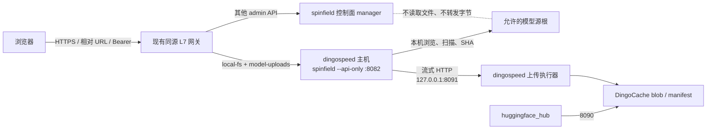
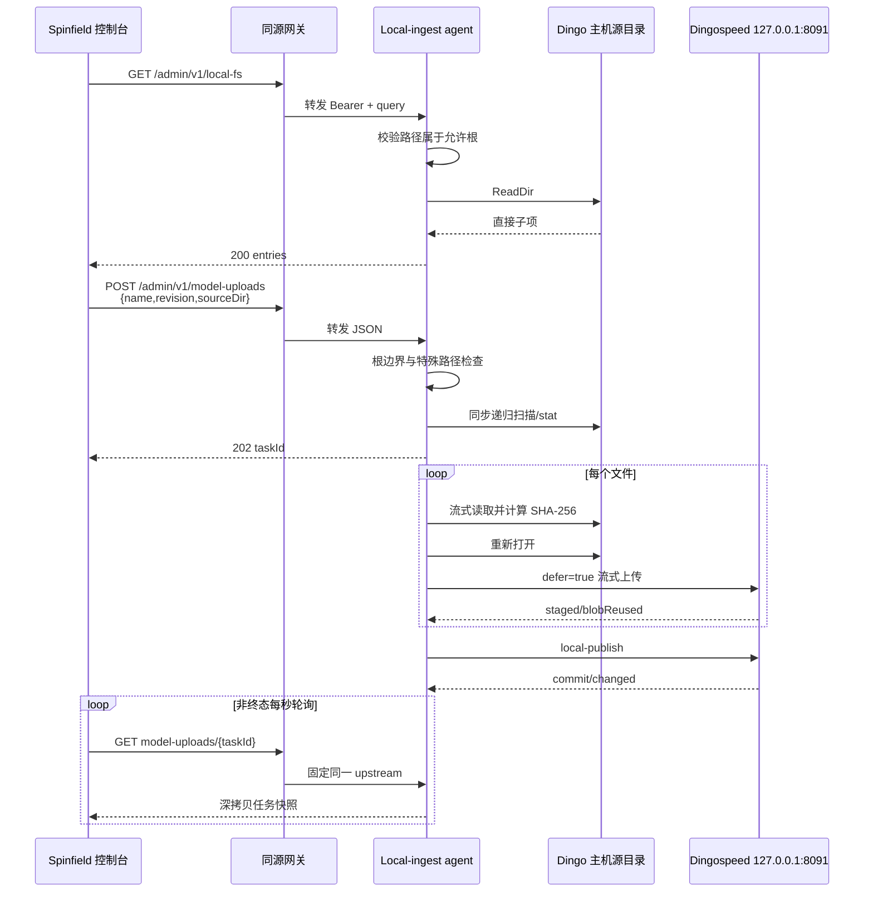

# spinfield api-only 迁移到 dingospeed 主机——详细设计（迁移环 1）

| 项目 | 内容 |
|---|---|
| 文档版本 | v1.0 |
| 状态 | 待评审 |
| 日期 | 2026-08-13 |
| 需求基线 | `spinfield-api-only-dingospeed-host-migration-requirements.md` v1.0 |
| 继承设计 | `spinfield-e2e-walkthrough-detailed-design.md` v1.0 |
| 设计性质 | 拓扑迁移增量设计；未覆盖部分继续沿用环 0 |

---

## 1. 设计目的与结论

本设计把环 0 已实现的 `spinfield --api-only` 从控制面主机迁移为 dingospeed 主机上的 host-local agent。核心结论如下：

| 决策 | 结论 |
|---|---|
| 代码载体 | 继续使用同一个 spinfield 二进制和 `--api-only`，本轮不拆仓库 |
| 部署位置 | 与 dingospeed 同一操作系统主机 |
| 字节路径 | 本地源文件 → api-only → `127.0.0.1:8091` → dingospeed |
| 浏览器接入 | 生产经现有 HTTPS 同源网关；不开放 CORS，不直连 8091 |
| API 路由 | 只把三个模型上传 API 路由到唯一 agent |
| dingospeed | Go 代码和协议零改动，继续作为文件分块/发布执行器 |
| 控制面 | 不注册模型上传领域服务，不读取、不代理模型文件 |
| 路径安全 | 新增强制源根白名单和 reparse/symlink 边界 |
| 任务存储 | 继续 MemStore；重启恢复明确不在本轮 |
| 多节点 | 不支持；网关后只能有一个 agent 实例 |

这使 dingospeed 保持功能单一，同时把依赖文件所在主机的扫描与 SHA 计算放到正确的数据位置。

---

## 2. 已核实的代码事实

- `cmd/main.go` 已在 `ctrl.GetConfigOrDie()`、`ctrl.NewManager()`、Kubernetes client 和 MySQL 前处理 `--api-only`；
- `internal/modelupload` 已独立实现配置、浏览、扫描、MemStore、流式 SHA、上传和 publish，不导入 Kubernetes/MySQL；
- `internal/adminapi.NewAPIOnlyServer` 只注册 health、login 和三个模型上传接口，其他 admin API 返回 JSON 404；
- `internal/console` 会把 CRA build 嵌入二进制并同源提供 SPA；Dockerfile 已有 web build → `internal/console/dist` 的构建链；
- 前端 `services/modelUploads.ts` 使用相对 `/admin/v1/...` URL，所有请求经过 `apiFetch`；
- 当前新增配置只有单个 `SPINFIELD_LOCAL_FS_START_DIR`，它不是安全边界；迁移前必须补充允许根；
- 当前 admin 地址固定为 `:8082`，迁移部署需要可配置监听地址；
- 当前 `DINGOSPEED_UPLOAD_BASE` 可以配置任意 http/https 地址，迁移部署必须显式使用 `http://127.0.0.1:8091`。

若实施时这些事实已变化，执行需求 §0.3 门禁。

---

## 3. 目标架构



### 3.1 控制流与数据流

控制流包括目录条目、任务创建 JSON、状态快照和 publish 结果，可以经过网关。数据流是模型文件内容，只允许存在于：

```text
dingospeed 主机文件系统 → api-only 进程 → 主机回环 socket → dingospeed
```

网关不得配置 request-body 镜像、缓存或审计 body。三个外部模型 API 的最大请求仍是 64 KiB 创建 JSON，不包含文件内容。

### 3.2 完整时序



---

## 4. 网关与路由设计

### 4.1 路由表

| 外部路径 | upstream |
|---|---|
| `GET /admin/v1/local-fs` | local-ingest agent |
| `POST /admin/v1/model-uploads` | local-ingest agent |
| `GET /admin/v1/model-uploads/*` | local-ingest agent |
| `/admin/v1/login` | spinfield 控制面 |
| 其他 `/admin/v1/*` | spinfield 控制面 |
| SPA 与静态资源 | 现有 spinfield 控制台 |

路由应按精确 method/path 配置，禁止将整个 `/admin/v1/` 都指向 api-only，否则部署、Zone、模板等接口会得到 JSON 404。

### 4.2 鉴权

- 浏览器继续用现有 `Authorization: Bearer <SPINFIELD_ADMIN_TOKEN>`；
- 网关透传 Authorization，不把 token 改成 query 或 cookie；
- 控制面和 agent 在本迁移环使用同一个 admin token；
- agent 自身继续执行 `requireAdminAuth`，不能只依赖网关已鉴权；
- `DINGOSPEED_UPLOAD_TOKEN` 只在 agent 进程环境中存在，通过 `X-Dingo-Upload-Token` 发到回环 8091；
- 网关和浏览器永远看不到 dingospeed token。

### 4.3 单实例与轮询亲和

本轮 upstream 只能指向一个 agent 地址。不得配置 round-robin、多副本或健康切换到另一主机，因为 taskId 只存在于创建它的 MemStore。

若 supervisor 重启同一进程，旧 taskId 丢失属于已知语义，前端收到 404 后提示重新创建，不尝试跨实例查找。

### 4.4 直接维护入口

agent 仍可用内嵌 console 提供 `/model-upload`，用于以下场景：

- 网关尚未切流时做主机本地冒烟；
- 控制面故障时诊断 agent 与 dingospeed；
- 验证无 CORS 的完整链路。

该入口只能在管理网访问。api-only 下其他 SPA 页面可能请求到 JSON 404，因此它不是生产完整控制台入口。

---

## 5. 配置设计

### 5.1 新增/调整配置

建议扩展 `internal/modelupload.Config` 和 admin server 组装：

```go
type Config struct {
    UploadBaseURL   *url.URL
    DownloadBaseURL *url.URL
    UploadToken     string
    RepoType        string
    Org             string
    PublishMaxFiles int
    BrowseStartDir  string
    AllowedRoots    []string
}
```

新增环境变量：

| 环境变量 | 必填 | 示例 | 说明 |
|---|---:|---|---|
| `SPINFIELD_ADMIN_ADDR` | 否 | `:8082` | agent 监听地址，默认保持 `:8082` |
| `SPINFIELD_LOCAL_FS_ROOTS` | api-only 必填 | `D:\model-source` | 允许浏览/导入的根目录列表 |

沿用：

| 环境变量 | agent 值 |
|---|---|
| `SPINFIELD_ADMIN_TOKEN` | 非空，与控制面一致 |
| `SPINFIELD_LOCAL_FS_START_DIR` | 可选；默认第一允许根，设置时必须在允许根内 |
| `DINGOSPEED_UPLOAD_BASE` | `http://127.0.0.1:8091` |
| `DINGOSPEED_DOWNLOAD_BASE` | `http://127.0.0.1:8090`，若 HF 下载从其他地址进入则只用于展示/指引，不影响 worker |
| `DINGOSPEED_UPLOAD_TOKEN` | 与 dingospeed 配置一致 |
| `DINGOSPEED_PUBLISH_MAX_FILES` | 与 dingospeed `publishMaxFiles` 一致 |

### 5.2 多根编码

Windows 环境建议 `SPINFIELD_LOCAL_FS_ROOTS` 使用操作系统 `PathListSeparator`（`;`）分隔：

```text
D:\model-source;E:\approved-imports
```

Linux 对应 `:`。解析使用 `filepath.SplitList`，不自行用逗号切分，以免破坏合法路径。

加载时对每个根执行：

1. `strings.TrimSpace`，拒绝空项；
2. `filepath.Abs` + `filepath.Clean`；
3. `os.Lstat`，要求存在且为目录；
4. 拒绝 symlink/reparse point；
5. 按平台语义去重；
6. 以最长路径优先保存，便于错误定位；
7. `BrowseStartDir` 为空时取第一根。

### 5.3 上传地址本地性

迁移验收要求 `DINGOSPEED_UPLOAD_BASE` 的 host 为 loopback：`127.0.0.1`、`localhost` 或 `::1`。实现建议在 api-only 模式拒绝非回环地址；正常 manager 模式继续保持环 0 的通用配置行为，避免无关兼容性回归。

此校验应放在 api-only 迁移组装层，而不是让通用 `DingoClient` 永久失去远端能力。

---

## 6. 路径边界设计

### 6.1 统一校验函数

新增不可绕过的领域函数：

```go
func ResolveAllowedPath(requested string, roots []string, startDir string) (string, error)
```

浏览和创建任务必须在任何 `ReadDir`、`WalkDir`、`Open` 之前调用它。禁止 handler 自己实现另一套路由判断。

### 6.2 归属判断

对规范化后的候选路径和每个根使用 `filepath.Rel(root, candidate)`：

- `rel == "."`：候选就是根，允许；
- `rel` 不为绝对路径，且第一段不是 `..`：候选在根内；
- 其他情况拒绝。

不能使用普通字符串前缀：

```text
D:\models2 不是 D:\models 的子目录
```

Windows 比较应遵循盘符和大小写不敏感语义。测试至少覆盖盘符大小写、目录名大小写和不同盘符。

### 6.3 链路组件检查

只校验最终路径不足以防止目录内 junction 跳出根。解析后的候选路径必须逐级 `Lstat` 从所属根走到目标：

- 任一级 `ModeSymlink != 0`：拒绝；
- Windows 任一级带 reparse point：拒绝；
- 浏览到不存在路径：拒绝；
- 创建任务扫描期间新遇到 symlink/reparse/non-regular：同步拒绝。

Windows reparse point 检测可以使用标准库暴露的文件属性或最小平台文件实现；若真实 Go 版本无法可靠判断，必须按冲突门禁验证后再决定依赖，不得只跳过测试。

### 6.4 TOCTOU 边界

本轮不实现文件系统快照。扫描后文件变化仍按环 0 规则在 hashing/uploading 阶段失败。允许根校验必须在：

- 浏览请求开始；
- 创建任务扫描开始；
- worker 打开文件前；

至少这三个位置执行，避免任务等待期间目录被替换为跳转点。

---

## 7. 服务组装与部署

### 7.1 启动顺序

`cmd/main.go` 保持：

```text
flag.Parse
→ logger/root context
→ api-only 配置校验（含 roots、loopback、admin addr）
→ 创建 MemStore/DingoClient/Service/APIOnlyServer
→ Start 并 return
→ 之后才是 TLS、Kubernetes manager、MySQL、controller/webhook/GC
```

控制面正常模式未设置全部 `DINGOSPEED_*` 时继续禁用模型上传。迁移部署必须确保控制面环境没有遗留变量。

### 7.2 admin 地址

`NewAPIOnlyServer` 组装时将 `SPINFIELD_ADMIN_ADDR` 注入 `Server.Addr`。校验规则：

- 空值默认 `:8082`；
- 必须可由 `net.SplitHostPort` 解析；
- 端口必须为 1–65535；
- 不接受 URL、path、query；
- 日志可以打印监听地址，不打印 token。

### 7.3 构建产物

推荐继续使用现有 Dockerfile 的多阶段构建，以保证真实 CRA build 被嵌入二进制。当前 Windows 原生部署若不使用容器，构建流程必须等价：

```text
npm ci / npm run build
→ 将 web/console/build 内容放入 internal/console/dist
→ go build spinfield.exe
```

不得直接把仓库内占位 `internal/console/dist/index.html` 当作生产控制台。

产物清单至少包括：

- `spinfield.exe` 或固定版本镜像；
- 不含真实 secret 的环境变量模板；
- Windows Service/supervisor 配置；
- 网关 route 配置；
- 版本、Git commit、构建时间信息；
- 启停、健康检查和回滚说明。

### 7.4 Windows 服务运行

服务账户必须：

- 对允许源根有读取/遍历权限；
- 对其他敏感目录无额外权限；
- 无需 Kubernetes 配置、集群凭证或 MySQL 凭证；
- 可以连接本机 8091；
- 日志目录可写。

服务依赖顺序：dingospeed 先启动，agent 后启动。agent 的 `/healthz` 只证明自身 HTTP 存活；上线前另做一次 dingospeed upload/publish readiness 冒烟。

---

## 8. API 与领域实现增量

### 8.1 API 保持不变

不改变环 0 的请求/响应字段和状态机。前端仍只发送 `name/revision/sourceDir`。路径边界失败映射为：

```json
{
  "error": "path_not_allowed",
  "message": "source path is outside configured roots"
}
```

HTTP 422。对于 symlink/reparse point：

```json
{
  "error": "path_not_allowed",
  "message": "source path contains a link or reparse point"
}
```

错误可以包含请求中的候选路径，但不得枚举其他允许根或根外目录内容。

### 8.2 Browse

`Browse("")` 返回 start dir。非空路径规范化后必须属于允许根。目录列表仍只展示目录和普通文件；如果条目自身是 link/reparse point，迁移模式下不展示，并记录不含目标地址的 debug 日志。

### 8.3 Scan/Create

同步扫描顺序调整为：

```text
校验 name/revision
→ ResolveAllowedPath(sourceDir)
→ 扫描时逐项拒绝 link/reparse/non-regular
→ 文件数/字节/溢出/可读性预检
→ 创建任务
```

任何路径错误都不得创建 task，也不得调用 dingospeed。

### 8.4 Worker 再校验

每个文件进入 hashing 前重新验证绝对路径仍属于原允许根、路径组件未成为 link/reparse point，然后按环 0 方式打开、哈希、关闭、重新打开和上传。

如果再校验失败：

- 文件状态 `failed`；
- 任务 `failed`；
- `stage=hashing`；
- 不上传该文件、不 publish。

### 8.5 DingoClient

HTTP 协议零变化：

- 上传 `POST /api/local-upload/models/dingo-local/{repo}/{revision}/{path}`；
- query 包含动态 size、sha256、`defer=true`；
- `Content-Length` 为源文件逻辑大小；
- token 在 `X-Dingo-Upload-Token`；
- 不发送 `overwrite=true`；
- 全文件成功后一次 local-publish。

本轮不新增把本地绝对路径传给 dingospeed 的参数。绝对路径是 agent 私有信息。

---

## 9. 前端设计增量

### 9.1 生产请求

`modelUploads.ts` 继续使用相对 URL，不增加 agent host、dingospeed host 或 token 字段。生产同源网关负责 upstream 选择。

这保证：

- `apiFetch` 的 Bearer 与 401 跳转不变；
- 无 CORS；
- 浏览器不需要知道数据节点地址；
- 后续更换 agent 地址不需要重新构建前端。

### 9.2 页面提示

目录浏览器应明确提示“当前展示的是模型存储节点上的允许导入目录”，避免用户误认为在浏览自己的电脑或 spinfield 控制面主机。

路径边界错误原样显示。不得在前端尝试规范化越界路径、自动改盘符或回退到浏览器上传。

### 9.3 开发联调

CRA `proxy: http://127.0.0.1:8082` 继续适用于在 dingospeed 主机本地运行前端。跨主机开发不通过新增 CORS 解决，可采用以下之一：

1. 使用真实同源测试网关；
2. 在开发机建立明确的 SSH/端口转发，使本地 8082 指向 agent；
3. 直接使用 agent 内嵌的 production build。

不得把远端 agent URL写入提交的长期 token 或浏览器构建变量。

---

## 10. 测试设计

### 10.1 配置测试

| 编号 | 用例 | 断言 |
|---|---|---|
| CFG-M01 | api-only 未设置 roots | 启动失败，指出配置名 |
| CFG-M02 | 单根/多根 | 规范化、去重、start dir 正确 |
| CFG-M03 | 根不存在/不是目录 | 启动失败 |
| CFG-M04 | start dir 越界 | 启动失败 |
| CFG-M05 | 上传 base 为 127.0.0.1 | 允许 |
| CFG-M06 | api-only 上传 base 为远端 IP | 拒绝 |
| CFG-M07 | admin addr 默认/合法自定义/非法 | 结果正确 |

### 10.2 路径测试

| 编号 | 用例 | 断言 |
|---|---|---|
| PATH-M01 | 根本身和普通子目录 | 允许 |
| PATH-M02 | `..` 越界 | 422，不读取根外目录 |
| PATH-M03 | 同名前缀 `models2` | 拒绝 |
| PATH-M04 | Windows 大小写和盘符大小写 | 按 Windows 语义判断 |
| PATH-M05 | 不同盘符 | 拒绝 |
| PATH-M06 | symlink | 浏览不展示，create 拒绝 |
| PATH-M07 | junction/reparse point | 浏览不展示，create 拒绝 |
| PATH-M08 | 扫描后路径被替换为链接 | worker hashing 前失败 |
| PATH-M09 | 根内普通多级目录 | 扫描和仓库路径保持 |

无法在当前权限创建 junction/symlink 时，Windows 测试可以显式 skip，但必须另有目标主机手工验收，不得把该验收项删除。

### 10.3 API 与路由测试

- api-only 三接口 Bearer 401/成功/路径 422；
- api-only `/admin/v1/zones` JSON 404，不访问 nil K8s client；
- 正常 manager 未配置 Dingo 时模型路由不存在；
- 网关三个精确路径命中 agent，login/zone/deployment 命中控制面；
- Authorization 原样透传；
- 创建请求和轮询响应均不含文件内容、SHA secret 或 dingospeed token；
- task 创建和轮询始终命中同一个 agent upstream。

### 10.4 回归命令

沿用用户批准的环 0 零失败门禁，并增加路径/配置测试：

```powershell
go test ./internal/modelupload
go test ./cmd
go test ./internal/adminapi -run 'TestModelUpload'
go test -race ./internal/modelupload
go test -race ./internal/adminapi -run 'TestModelUpload'

Set-Location web/console
npm test -- --watchAll=false
npm run build
```

`go test ./internal/adminapi` 全量的既有 11 项失败继续按已批准基线单独报告，不得修改 deployment/template/zone/release 测试或行为来完成本迁移。

---

## 11. 部署与切换步骤

### 11.1 前置检查

1. 记录两个仓库 git status，保护所有用户资产；
2. 在目标 dingospeed 主机确认源根、权限、磁盘和 8090/8091；
3. 用动态 size/SHA 命令直连冒烟 dingospeed；
4. 确认控制面主机不具备源目录访问路径；
5. 准备非空且一致的 admin/upload token；
6. 确认网关支持精确 path/method upstream。

### 11.2 部署

1. 构建带真实内嵌 console 的版本化 spinfield 产物；
2. 在 dingospeed 主机安装 agent 服务账户和配置；
3. 先启动 dingospeed，再启动 `spinfield --api-only`；
4. 在目标主机直接检查 `/healthz`、login、local-fs；
5. 通过 agent 内嵌页面完成一次小目录 E2E；
6. 配置同源网关的三个精确路由；
7. 从正式控制台完成相同 E2E；
8. 移除控制面残留 `DINGOSPEED_*` 并确认模型路由只由 agent 提供。

### 11.3 切换判定

切换前后分别记录：

- agent 主机名、进程 PID/版本、监听地址；
- `DINGOSPEED_UPLOAD_BASE` 脱敏后的 host/port；
- 源根规范化结果；
- 网关 upstream；
- 任务 repo/revision/commit；
- blob 存在性；
- HF 下载和独立比对结果；
- 控制面/网关请求 body 最大值，证明没有模型字节经过。

---

## 12. 真实 E2E 设计

测试目录必须只在 dingospeed 主机允许根内存在，并至少包含根文件、README、子目录和子目录文件。

验收脚本分为三端：

1. **dingospeed 主机**：重新扫描源目录，输出相对路径、size、SHA；
2. **控制面/网关**：只输出三个 API 的 method/path/status/request size，不读取源文件；
3. **独立下载端**：使用标准 `snapshot_download`，再独立计算下载文件清单、size、SHA 和字节比较。

通过条件：

```text
PASS agent-host == dingospeed-host
PASS api-only without kubeconfig/mysql/kubernetes
PASS source unavailable on control-plane
PASS gateway routed 3 model APIs to agent
PASS agent upload target == 127.0.0.1:8091
PASS no model bytes crossed browser/gateway/control-plane
PASS commit non-empty
PASS blobs exist for every source SHA
PASS huggingface_hub snapshot_download
PASS path-set / sizes / sha256 / byte-for-byte
PASS out-of-root and link/reparse rejection
```

DingoCache 物理封装开销继续沿用环 0 已确认口径：源 SHA 命名的 blob 必须存在，最终以标准客户端下载后的逻辑 size、SHA-256 和逐字节内容为准。

---

## 13. 失败处理与回滚设计

### 13.1 切换失败

- 网关验证失败：立即撤销三个新路由，agent 保持内网诊断状态；
- agent 启动失败：不把请求回落到控制面本地扫描，入口明确返回不可用；
- Dingo loopback 冒烟失败：停止迁移，不继续页面测试；
- 路径边界测试失败：不得开放 8082 给网关；
- E2E 内容不一致：停止切换，保留 repo/revision/commit 和日志用于定位。

### 13.2 数据处理

回滚不删除已上传、暂存或已发布数据。数据清理由 dingospeed 既有规则或另行审批处理，不写进自动回滚脚本。

### 13.3 已知限制

| 限制 | 本轮处理 | 后续 |
|---|---|---|
| agent 重启丢任务 | 明确提示重新创建；复用已有 blob | 任务持久化环 |
| 单节点 | 网关固定单 upstream | 节点注册/路由环 |
| 共享 admin token | 管理网 + TLS + agent 二次校验 | 用户/RBAC/审计环 |
| 双遍读取和 loopback HTTP | 接受，保持协议不变 | 可评估 dingospeed 本地路径原语，但需新需求 |
| 无断点续传/重试 | 失败重建任务 | 大文件可靠性环 |
| 无文件系统快照 | worker 前再校验，变化则失败 | 快照/句柄固定环 |

---

## 14. 需求覆盖矩阵

| 需求 | 设计章节 |
|---|---|
| api-only 部署到 dingospeed 主机 | §3、§7、§11 |
| 模型字节不经过控制面 | §3.1、§4、§12 |
| 同源前端与 Bearer/401 | §4、§9 |
| dingospeed 保持单一且零代码改动 | §1、§8.5 |
| 上传端使用回环地址 | §5.3、§11、§12 |
| 源根白名单与链接边界 | §5.2、§6、§8 |
| API/状态/进度兼容 | §8、环 0 继承设计 |
| 单 agent/无随机负载均衡 | §4.3 |
| Windows 原生部署 | §7.3、§7.4 |
| 双主机语义 E2E | §12 |
| 回滚不删数据 | §13 |

---

## 15. 实施前评审检查表

- [ ] 确认本轮只有一个 dingospeed 主机和一个 agent upstream；
- [ ] 确认源文件不在控制面主机，且不依赖共享盘；
- [ ] 确认 api-only 仍早于 kubeconfig/manager/MySQL/Kubernetes；
- [ ] 确认三个模型 API 精确路由，其他 admin API 不受影响；
- [ ] 确认 agent 和控制面 token 一致且网关透传 Authorization；
- [ ] 确认 dingospeed upload token 只在目标主机；
- [ ] 确认上传 base 是 `127.0.0.1:8091`；
- [ ] 确认源根白名单、同名前缀、`..`、symlink/junction/reparse 测试设计可执行；
- [ ] 确认控制面不配置 `DINGOSPEED_*`；
- [ ] 确认网关不缓存/镜像模型 API body；
- [ ] 确认真实 CRA build 被嵌入产物而非占位页；
- [ ] 确认重启丢任务和单节点限制被业务接受；
- [ ] 确认完整 E2E 使用标准 `huggingface_hub` 和独立逐字节校验；
- [ ] 确认回滚不自动删除 dingospeed 数据。

