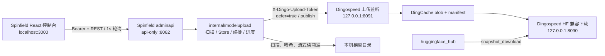
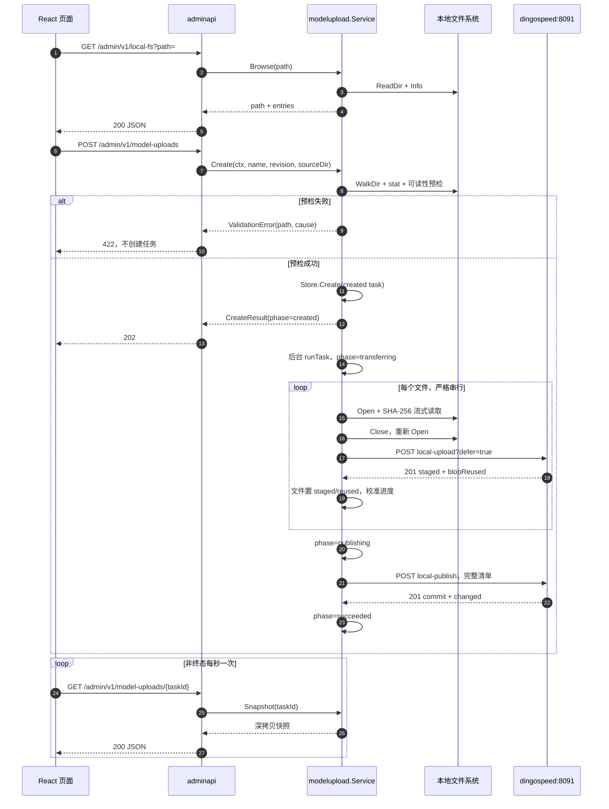
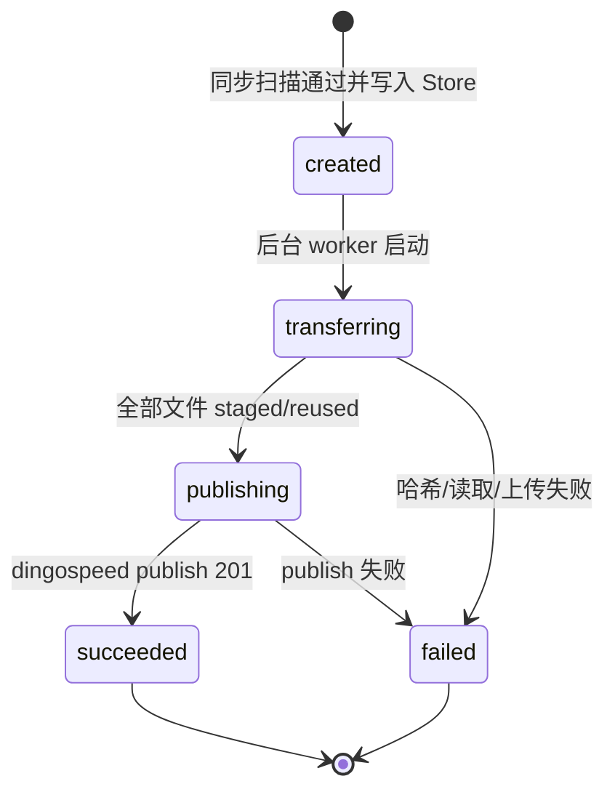
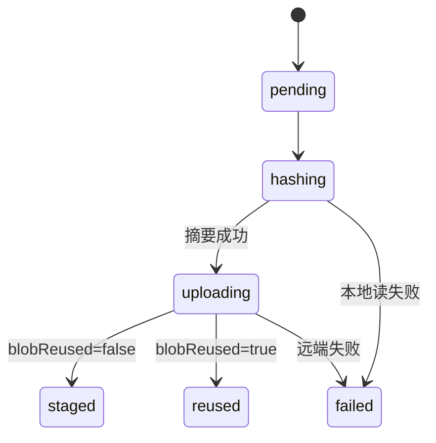

# spinfield × dingospeed 链路打通——详细设计（环 0）

| 项目 | 内容 |
|---|---|
| 文档版本 | v1.0 |
| 状态 | 待评审 |
| 日期 | 2026-08-12 |
| 需求基线 | [spinfield-e2e-walkthrough-requirements.md](./spinfield-e2e-walkthrough-requirements.md) v2.2 |
| 设计范围 | 环 0：本机目录 → spinfield → dingospeed → Hugging Face 标准客户端下载 |
| 主要实现仓库 | `D:\project\workplace\spinfield` |
| 配置与文档仓库 | `D:\project\workplace\ModelManager\dingospeed` |
| 目标读者 | 开发、测试、评审、后续维护者、编码 Agent |

---

## 1. 文档目的

本文把需求基线细化为可直接编码和测试的设计，重点回答以下问题：

1. 如何让 spinfield 模型上传 API 在不创建 controller-runtime manager、不读取 kubeconfig 的情况下启动；
2. 如何扫描本地目录、计算 SHA-256、按文件流式上传，并在最后一次性发布；
3. REST API、Go 函数和前端服务的入参、出参、状态及错误语义是什么；
4. 如何保证内存任务状态在后台写、前端轮询并发下仍然正确；
5. 如何以单元测试、接口测试、前端测试和真实 E2E 覆盖需求中的六项核心验收。

本文是详细设计，不改变需求范围。发现本文与真实代码或运行结果冲突时，必须执行需求文档 §0.4 的门禁；不得自行扩大范围或静默替换方案。

---

## 2. 设计结论摘要

| 决策 | 结论 | 理由 |
|---|---|---|
| dingospeed 改动 | 零代码改动，只设置本机 `upload` 配置 | 上传、暂存、发布和下载能力均已存在 |
| 后端领域包 | 新增 `spinfield/internal/modelupload` | 与 Kubernetes、MySQL、Jenkins、controller-runtime manager 解耦 |
| HTTP 接入 | 在 `internal/adminapi` 增加三个薄 handler | 复用 chi、Bearer token、错误响应和 8082 端口 |
| api-only 启动 | `cmd/main.go` 在 `ctrl.GetConfigOrDie()` 前处理 `--api-only` | 无 kubeconfig 环境可真实启动；正常 manager 模式不回归 |
| 任务存储 | 进程内 `MemStore`，`sync.RWMutex` + 深拷贝快照 | 满足环 0；重启丢失可接受 |
| 文件处理 | 单任务内逐文件串行执行“哈希 → 重新打开 → 上传” | 常量内存、保留页缓存局部性、符合需求 |
| 上传协议 | 每文件 `defer=true`，全部成功后调用一次 `local-publish` | 下载侧只看到完整版本 |
| 覆盖策略 | 不发送 `overwrite=true`，等价于固定 `false` | 仅支持新版本或相同内容幂等重跑 |
| 前端接入 | 新建独立 `services/modelUploads.ts`，直接调用真实 admin API | 不扩展 `IApiAdapter`，不为 MockAdapter 补伪实现 |
| 前端进度 | 1 秒递归 `setTimeout` 轮询，终态停止 | 避免 SSE 和重叠请求 |
| CRA 联调 | `package.json` 增加 `proxy: http://127.0.0.1:8082` | 同源访问 `/admin/*`，无需 CORS |

### 2.1 已核实的代码事实

- spinfield 当前在 [cmd/main.go](../../../spinfield/cmd/main.go) 中先调用 `ctrl.GetConfigOrDie()` 创建 manager，之后才构造 adminapi，必须增加早分支。
- spinfield adminapi 已有 chi 路由、`/healthz`、共享 Bearer token 和统一 JSON 错误响应，见 [server.go](../../../spinfield/internal/adminapi/server.go)、[auth.go](../../../spinfield/internal/adminapi/auth.go)、[helpers.go](../../../spinfield/internal/adminapi/helpers.go)。
- spinfield 前端真实请求统一经 `apiFetch` 添加 Bearer token，见 [auth.ts](../../../spinfield/web/console/src/lib/auth.ts)。
- dingospeed 的上传和发布成功均返回 HTTP 201，失败返回 `{code,error}`；发布成功返回 `commit/changed/status`，见 [upload_handler.go](../internal/handler/upload_handler.go)、[upload_dao.go](../internal/dao/upload_dao.go)。
- dingospeed 当前实际配置中的 `upload.token` 为空，实施/验收前必须按需求修改配置；这不是代码缺陷。

---

## 3. 范围

### 3.1 本期实现

- 浏览 spinfield 后端进程可读的本机目录；
- 创建一个内存模型上传任务；
- 同步递归扫描和预检目录；
- 后端计算每个文件的 SHA-256；
- 后端把文件流式上传到 dingospeed 暂存区；
- 全文件成功后原子发布；
- 前端展示阶段、总进度、文件状态、commit 和错误；
- 无 Kubernetes 的 api-only 启动；
- 使用标准 `huggingface_hub` 下载并逐字节验收。

### 3.2 本期不实现

以下能力不得成为环 0 的代码或验收前置：

- 浏览器传输模型字节、浏览器计算摘要；
- SSE、断点续传、暂停、取消、重试、任务恢复、任务列表；
- MySQL、模型资产表、仓库列表、容量页、五 tab 详情；
- 覆盖不同内容、删除旧文件、`baseCommit`、冲突策略选择；
- 源根白名单、真实用户/RBAC、审计、密钥托管、跨主机；
- README 生成、模型元信息、远端拉取、DingoFS 专用逻辑；
- dingospeed 代码变更。

### 3.3 兼容性要求

- 正常 manager 模式的现有 controller、webhook、adminapi、console 行为保持不变；
- `SPINFIELD_ADMIN_TOKEN` 为空时仍保持现有“鉴权关闭”语义；
- 未配置 dingospeed 环境变量时，正常 manager 模式可继续启动，模型上传路由不注册并记录功能未启用日志；
- `--api-only` 模式缺少必要的 dingospeed 配置时启动失败并明确指出缺失项；
- 不改变现有 `IApiAdapter` 的 mock/real 选择和现有页面请求行为。

---

## 4. 总体架构



### 4.1 组件职责

| 组件 | 职责 | 明确不负责 |
|---|---|---|
| React 页面 | 目录选择、表单校验、创建任务、轮询和展示 | 文件读取、SHA-256、上传 token、重试 |
| adminapi handler | HTTP 解码/编码、鉴权复用、状态码映射 | 任务状态机、文件 I/O、dingospeed 协议细节 |
| `modelupload.Service` | 同步预检、建任务、后台串行编排、失败收口 | HTTP 展示、Kubernetes、持久化 |
| `modelupload.MemStore` | 并发安全地保存任务并提供深拷贝快照 | 跨进程恢复、历史查询 |
| `modelupload.DingoClient` | 构造 URL、带 token、流式上传、解析远端响应/错误 | 重试、任务状态 |
| dingospeed | blob 落盘、摘要校验、去重、manifest、commit、HF 下载 | spinfield 任务、前端状态 |

### 4.2 完整时序



---

## 5. 代码改动设计

### 5.1 dingospeed 仓库

| 路径 | 改动 |
|---|---|
| `config/config.yaml` | 本机运行前设置 `upload.token: dev-token-change-me`；其余按需求值核对 |
| `docs/` | 保留需求与本文档；不修改 dingospeed Go 代码 |

### 5.2 spinfield 后端

建议新增以下文件；文件名允许在实现时做不影响职责的微调。

```text
internal/modelupload/
  types.go          # Config、任务/文件状态、内部模型、API 快照
  config.go         # 环境变量加载与 URL/上限校验
  scan.go           # 目录浏览、递归扫描、仓库相对路径生成
  store.go          # Store 接口与并发安全 MemStore
  progress.go       # progressReader 与进度校准
  client.go         # DingoClient 接口、HTTP 实现、远端错误
  service.go        # Create/Get/runTask/hash/upload/publish 编排
  *_test.go

internal/adminapi/
  model_uploads.go       # 三个 handler 与路由注册
  model_uploads_test.go
  server.go              # 可选 ModelUploads、APIOnly 模式、路由分组

cmd/
  main.go                # --api-only 早分支、可选启用模型上传
  model_upload.go        # 纯配置/组装辅助函数（如 main.go 过长）
```

### 5.3 spinfield 前端

```text
web/console/src/
  types/modelUpload.ts
  services/modelUploads.ts
  pages/ModelUpload.tsx
  __tests__/model-upload-service.test.ts
  __tests__/model-upload-page.test.tsx

现有文件修改：
  App.tsx
  components/Layout/Sidebar.tsx
  locales/zh_CN.json
  locales/en_US.json
  package.json
```

环 0 不新增 `mocks/modelUploads.ts`，也不向 `IApiAdapter` 增加模型上传方法。

---

## 6. 运行配置与启动设计

### 6.1 spinfield 环境变量

| 环境变量 | api-only | 默认值 | 用途 | 日志规则 |
|---|---:|---|---|---|
| `SPINFIELD_ADMIN_TOKEN` | 可选 | 空（关闭鉴权） | 复用现有 admin API Bearer token | 不打印值 |
| `DINGOSPEED_UPLOAD_BASE` | 必填 | 无 | 例：`http://127.0.0.1:8091` | 只打印脱敏后的 scheme/host |
| `DINGOSPEED_DOWNLOAD_BASE` | 必填 | 无 | 例：`http://127.0.0.1:8090`，用于启动信息和 E2E 指引；环 0 worker 不经此地址下载 | 可打印完整本机地址 |
| `DINGOSPEED_UPLOAD_TOKEN` | 必填 | 无 | 后端到 dingospeed 的上传凭证 | 绝不下发浏览器、绝不打印 |
| `DINGOSPEED_PUBLISH_MAX_FILES` | 可选 | `1000` | 同步扫描文件数上限，必须与 dingospeed 配置一致 | 打印数值 |
| `SPINFIELD_LOCAL_FS_START_DIR` | 可选 | 进程工作目录 | `path` 为空时目录浏览器的起点；不是白名单 | 可打印路径；仅本机演示 |

### 6.2 `modelupload.Config`

```go
type Config struct {
    UploadBaseURL   *url.URL
    DownloadBaseURL *url.URL
    UploadToken     string
    RepoType        string // 固定 models
    Org             string // 固定 dingo-local
    PublishMaxFiles int
    BrowseStartDir  string
}
```

配置加载函数：

```go
func LoadConfig(getenv func(string) string) (Config, error)
```

| 入参 | 含义 |
|---|---|
| `getenv` | 环境读取函数；生产传 `os.Getenv`，测试传 map 闭包 |

| 出参 | 含义 |
|---|---|
| `Config` | 已完成默认值填充、URL 解析、上限与起始目录规范化的不可变配置 |
| `error` | 缺少必填项、URL 非 http/https、URL 缺 host、上限非正整数或起点无法解析时返回 |

处理逻辑：

1. 读取两个 base URL 和 token；
2. URL 只接受 `http`/`https`，拒绝 userinfo、query、fragment；保留可选 path 前缀；
3. 固定 `RepoType=models`、`Org=dingo-local`；
4. `DINGOSPEED_PUBLISH_MAX_FILES` 未设置时取 1000；
5. 起始目录为空时调用 `os.Getwd()`，再用 `filepath.Abs`、`filepath.Clean` 规范化；
6. 错误文本只包含配置项名，不包含 token 值。

### 6.3 `--api-only` 早分支

`cmd/main.go` 的顺序必须调整为：

```text
注册 flag（含 --api-only）
→ flag.Parse
→ 初始化 logger
→ rootCtx := ctrl.SetupSignalHandler()
→ 加载可选/必需的 modelupload 配置
→ 若 --api-only：构造 MemStore、Dingo HTTP client、Service、APIOnly Server，阻塞 Start 后 return
→ 以下才允许执行现有 TLS / ctrl.GetConfigOrDie / ctrl.NewManager / K8s client 初始化
```

禁止在 api-only 分支前执行：

- `ctrl.GetConfigOrDie()`；
- `ctrl.NewManager()`；
- `kubernetes.NewForConfig()`；
- MySQL `PingContext`；
- controller/webhook/GC 注册。

建议组装函数：

```go
func runAPIOnly(ctx context.Context, cfg modelupload.Config) error
```

| 入参 | 含义 |
|---|---|
| `ctx` | 进程信号上下文，控制 HTTP server 和后台任务生命周期 |
| `cfg` | 已校验的模型上传配置 |

| 出参 | 含义 |
|---|---|
| `error` | server 监听失败或非正常退出原因；正常 shutdown 返回 `nil` |

### 6.4 正常 manager 模式

正常模式按以下规则兼容：

- 三个 dingospeed 必填环境变量均未设置：记录 `Model upload disabled`，现有启动不受影响；
- 部分设置：视为配置错误并拒绝启动，避免“看似启用、实际缺 token”；
- 全部设置：创建同一个 `modelupload.Service`，赋给正常 `adminapi.Server.ModelUploads`，使功能也可在完整 manager 中使用；
- 模型上传 handler 只调用 `ModelUploads`，不得读取 `s.Client`、`s.Clientset` 或其他 K8s store。

---

## 7. 领域模型与状态机

### 7.1 枚举

```go
type TaskPhase string

const (
    PhaseCreated      TaskPhase = "created"
    PhaseTransferring TaskPhase = "transferring"
    PhasePublishing   TaskPhase = "publishing"
    PhaseSucceeded    TaskPhase = "succeeded"
    PhaseFailed       TaskPhase = "failed"
)

type FileStatus string

const (
    FilePending   FileStatus = "pending"
    FileHashing   FileStatus = "hashing"
    FileUploading FileStatus = "uploading"
    FileStaged    FileStatus = "staged"
    FileReused    FileStatus = "reused"
    FileFailed    FileStatus = "failed"
)
```

### 7.2 内部文件对象

```go
type taskFile struct {
    AbsPath            string
    RepoPath           string
    Size               int64
    SHA256             string
    Status             FileStatus
    ProcessedWorkBytes int64
}
```

| 字段 | 说明 |
|---|---|
| `AbsPath` | 本地读取路径，仅在后端内存中存在，不序列化 |
| `RepoPath` | `filepath.Rel` 后再 `filepath.ToSlash`，发给 dingospeed |
| `Size` | 同步扫描时取得的字节数 |
| `SHA256` | 哈希完成后填入，64 位小写 hex，不对前端暴露也可满足环 0 |
| `Status` | 文件状态 |
| `ProcessedWorkBytes` | 范围 `0..2*Size`；哈希和上传各占 `Size` |

### 7.3 内部任务对象

```go
type task struct {
    ID                 string
    Name               string
    Revision           string
    SourceDir          string
    Phase              TaskPhase
    Files              []taskFile
    TotalFiles         int
    DoneFiles          int
    SourceBytes        int64
    TotalWorkBytes     int64
    ProcessedWorkBytes int64
    Commit             string
    Changed            bool
    Error              *TaskError
}
```

`SourceDir` 和 `AbsPath` 不进入 GET 快照，避免把服务端绝对路径扩散到不需要的前端状态；错误中可以按需求返回失败路径。

### 7.4 错误对象

```go
type TaskError struct {
    Stage   string `json:"stage"`
    Path    string `json:"path,omitempty"`
    Code    string `json:"code,omitempty"`
    Message string `json:"message"`
}
```

| `Stage` | 触发位置 | `Path` | `Code` |
|---|---|---|---|
| `hashing` | 打开/读取/摘要计算失败 | 仓库相对路径 | 可空 |
| `uploading` | 单文件上传失败 | 仓库相对路径 | 原样保留 dingospeed `code` |
| `publishing` | 批量发布失败 | 空 | 原样保留 dingospeed `code` |
| `internal` | 后台未预期 panic/状态更新失败 | 可空 | `MODEL_UPLOAD_INTERNAL` |

### 7.5 状态转换



单文件状态：



### 7.6 必须保持的不变量

1. 任务 phase 只能沿状态图前进，终态不可修改；
2. `0 <= DoneFiles <= TotalFiles`；
3. `SourceBytes = sum(file.Size)`；
4. `TotalWorkBytes = 2 * SourceBytes`，计算前检查 `int64` 溢出；
5. `ProcessedWorkBytes = sum(file.ProcessedWorkBytes)`；
6. `0 <= file.ProcessedWorkBytes <= 2 * file.Size`；
7. `succeeded` 时 `DoneFiles == TotalFiles`、`Commit != ""`；
8. 非失败任务 `Error == nil`；失败任务 `Error != nil`；
9. publish 清单与扫描文件一一对应，路径不重复；
10. 文件和 publish 清单按 `RepoPath` 升序，保证展示及测试确定性。

零字节边界：非空目录可以只包含零字节普通文件，此时 `TotalWorkBytes=0`。后端仍可完成哈希、上传和发布；前端在非终态显示 0%，成功后显示 100%，不得除以零。

---

## 8. REST API 详细设计

### 8.1 通用约定

| 项 | 约定 |
|---|---|
| Base path | `/admin/v1` |
| 鉴权 | 完全复用 `SPINFIELD_ADMIN_TOKEN`；启用时要求 `Authorization: Bearer <token>` |
| JSON | UTF-8，响应 `Content-Type: application/json` |
| 未知字段 | 创建任务请求使用 `json.Decoder.DisallowUnknownFields()` 拒绝 |
| 请求体上限 | 创建任务 JSON 最大 64 KiB |
| 同步错误格式 | 复用 `{ "error": "...", "message": "..." }` |
| 后台错误格式 | GET 任务的 `error` 字段使用 `TaskError` |
| 路径编码 | 浏览 API 的 `path` 用标准 query 编码；dingospeed URL 每个 path segment 单独 `PathEscape` |

所有接口先经过现有 `requireAdminAuth`。因此未授权统一返回：

```json
{
  "error": "unauthorized",
  "message": "missing or invalid bearer token"
}
```

### 8.2 浏览目录

#### 8.2.1 请求

```http
GET /admin/v1/local-fs?path=D%3A%5Cmodels
Authorization: Bearer <SPINFIELD_ADMIN_TOKEN>
```

| 参数 | 类型 | 必填 | 规则 |
|---|---|---:|---|
| `path` | string | 否 | 空时使用 `SPINFIELD_LOCAL_FS_START_DIR`；非空时经 `filepath.Abs/Clean` 规范化 |

#### 8.2.2 成功响应

HTTP 200：

```json
{
  "path": "D:\\models",
  "entries": [
    {"name": "demo", "directory": true, "size": 0},
    {"name": "README.md", "directory": false, "size": 1234}
  ]
}
```

| 字段 | 类型 | 说明 |
|---|---|---|
| `path` | string | 后端规范化后的绝对当前目录 |
| `entries[].name` | string | 直接子项名称，不含父路径 |
| `entries[].directory` | bool | 是否为目录 |
| `entries[].size` | int64 | 普通文件大小；目录固定为 0 |

排序规则：目录在前、普通文件在后；组内按名称不区分大小写升序，相同折叠结果再按原始名称升序。

非目录、非普通文件的条目不展示；任务创建时若递归扫描遇到此类条目仍会同步拒绝，不能把“浏览时没显示”当成安全保证。

#### 8.2.3 失败响应

| HTTP | `error` | 场景 |
|---:|---|---|
| 400 | `invalid_path` | 路径含 NUL、无法转绝对路径 |
| 422 | `not_a_directory` | 不存在或不是目录 |
| 422 | `directory_unreadable` | `ReadDir` 或条目 `Info` 失败；message 含路径和 OS 原因 |
| 401 | `unauthorized` | Bearer token 缺失/错误 |

向上导航不新增协议字段。前端把当前路径拼接 `..` 后再次调用，后端 `Clean`：Windows 使用 `\..`，Unix 使用 `/..`。

### 8.3 创建模型上传任务

#### 8.3.1 请求

```http
POST /admin/v1/model-uploads
Content-Type: application/json
Authorization: Bearer <SPINFIELD_ADMIN_TOKEN>

{
  "name": "demo-model",
  "revision": "v1.0.0",
  "sourceDir": "D:\\models\\demo-model"
}
```

| 字段 | 类型 | 必填 | 校验 |
|---|---|---:|---|
| `name` | string | 是 | `^[A-Za-z0-9][A-Za-z0-9._-]{0,127}$` |
| `revision` | string | 是 | 同上 |
| `sourceDir` | string | 是 | 非空，规范化后必须存在且为目录 |

前端不得提交 `files`、`size`、`sha256`、`org`、`repoType`、`overwrite` 或上传 token。

#### 8.3.2 同步处理

HTTP handler 返回 202 前必须完成：

1. JSON 语法、未知字段和必填字段校验；
2. name/revision 正则校验，不做静默规范化；
3. `sourceDir` 绝对化和目录校验；
4. `WalkDir` 全量递归扫描；
5. 每个普通文件执行 `Info`、一次可打开性检查后立即关闭；
6. 生成唯一仓库相对路径；
7. 统计文件数和 `SourceBytes`，校验文件上限与 `int64` 溢出；
8. 按仓库路径排序；
9. 生成 task ID 并将完整任务一次写入 Store；
10. 启动仅依赖服务根上下文的后台 goroutine。

任一步失败均不得创建任务。

#### 8.3.3 成功响应

HTTP 202：

```json
{
  "taskId": "up-27c866ca65f3498a85fbd5d27aeb2ab2",
  "phase": "created",
  "totalFiles": 8,
  "sourceBytes": 123456789,
  "totalWorkBytes": 246913578,
  "processedWorkBytes": 0
}
```

后台任务可能在响应到达前已经进入 `transferring`，但创建响应固定表达“已成功创建”的 `created` 快照；后续真实状态以 GET 为准。

#### 8.3.4 失败响应

| HTTP | `error` | 场景 |
|---:|---|---|
| 400 | `invalid_request` | JSON 非法、未知字段、请求体过大 |
| 422 | `validation_failed` | name/revision/sourceDir 不合法 |
| 422 | `scan_failed` | 不存在、非目录、空目录、权限失败、特殊条目、相对路径失败、文件数超限、字节数溢出；message 含具体路径和原因 |
| 500 | `task_create_failed` | 安全随机 ID 或 Store 写入出现内部错误 |

### 8.4 查询任务

#### 8.4.1 请求

```http
GET /admin/v1/model-uploads/{taskId}
Authorization: Bearer <SPINFIELD_ADMIN_TOKEN>
```

`taskId` 必须为非空 path segment；handler 只读 Store 快照。

#### 8.4.2 成功响应

HTTP 200：

```json
{
  "taskId": "up-27c866ca65f3498a85fbd5d27aeb2ab2",
  "name": "demo-model",
  "revision": "v1.0.0",
  "phase": "transferring",
  "totalFiles": 8,
  "doneFiles": 3,
  "sourceBytes": 123456789,
  "totalWorkBytes": 246913578,
  "processedWorkBytes": 80000000,
  "files": [
    {
      "path": "subdir/config.json",
      "size": 1234,
      "status": "staged",
      "processedWorkBytes": 2468
    }
  ],
  "commit": "",
  "changed": false,
  "error": null
}
```

成功终态示例：

```json
{
  "taskId": "up-27c866ca65f3498a85fbd5d27aeb2ab2",
  "name": "demo-model",
  "revision": "v1.0.0",
  "phase": "succeeded",
  "totalFiles": 1,
  "doneFiles": 1,
  "sourceBytes": 1234,
  "totalWorkBytes": 2468,
  "processedWorkBytes": 2468,
  "files": [
    {
      "path": "config.json",
      "size": 1234,
      "status": "staged",
      "processedWorkBytes": 2468
    }
  ],
  "commit": "7df07f...",
  "changed": true,
  "error": null
}
```

真实响应始终返回完整文件快照。完成态仓库 ID 由固定组织和 name 组成：`dingo-local/demo-model`。

失败终态示例：

```json
{
  "taskId": "up-27c866ca65f3498a85fbd5d27aeb2ab2",
  "name": "demo-model",
  "revision": "v1.0.0",
  "phase": "failed",
  "totalFiles": 1,
  "doneFiles": 0,
  "sourceBytes": 1234,
  "totalWorkBytes": 2468,
  "processedWorkBytes": 1500,
  "files": [
    {
      "path": "weights/model-00002.safetensors",
      "size": 1234,
      "status": "failed",
      "processedWorkBytes": 1500
    }
  ],
  "commit": "",
  "changed": false,
  "error": {
    "stage": "uploading",
    "path": "weights/model-00002.safetensors",
    "code": "UPLOAD_INVALID_CONTENT",
    "message": "sha256 mismatch: ..."
  }
}
```

#### 8.4.3 失败响应

| HTTP | `error` | 场景 |
|---:|---|---|
| 404 | `task_not_found` | Store 中不存在该 task ID，包括进程重启后的旧 ID |
| 401 | `unauthorized` | Bearer token 缺失/错误 |

---

## 9. 后端函数详细设计

### 9.1 目录浏览与扫描

#### 9.1.1 `Browse`

```go
func (s *Service) Browse(ctx context.Context, rawPath string) (LocalFSResult, error)
```

| 入参 | 说明 |
|---|---|
| `ctx` | 请求上下文；在读取条目循环中检查取消 |
| `rawPath` | query 中的原始 path；空值使用配置起点 |

| 出参 | 说明 |
|---|---|
| `LocalFSResult` | 规范化绝对目录和排序后的直接子项 |
| `error` | `PathError`，携带分类、路径和底层错误 |

逻辑：选择路径 → `filepath.Abs/Clean` → `os.Stat` → `os.ReadDir` → 每项 `Info` → 只保留目录/普通文件 → 排序 → 返回。

#### 9.1.2 `ScanDirectory`

```go
func ScanDirectory(ctx context.Context, sourceDir string, maxFiles int) (ScanResult, error)
```

```go
type ScanResult struct {
    SourceDir   string
    Files       []ScannedFile
    SourceBytes int64
}

type ScannedFile struct {
    AbsPath  string
    RepoPath string
    Size     int64
}
```

| 入参 | 说明 |
|---|---|
| `ctx` | 创建任务的请求上下文；扫描期间取消则终止且不建任务 |
| `sourceDir` | 用户选择的目录，函数内部绝对化 |
| `maxFiles` | 单次 publish 文件数上限 |

| 出参 | 说明 |
|---|---|
| `ScanResult` | 已排序且可直接转任务的文件清单与总字节数 |
| `error` | 包含失败绝对路径和 OS/校验原因 |

每个条目的逻辑：

```go
if d.IsDir() {
    return nil
}
info, err := d.Info()
if err != nil || !info.Mode().IsRegular() {
    return scanError
}
f, err := os.Open(path) // 同步确认当前可读
if err != nil { return scanError }
_ = f.Close()

rel, err := filepath.Rel(sourceDir, path)
if err != nil { return scanError }
repoPath := filepath.ToSlash(rel)
```

附加检查：

- `rel` 不得为 `.`、绝对路径或以 `..` 跳出；
- `repoPath` 不得为空或重复；
- 文件计数一旦超过上限立即停止；
- `SourceBytes + size` 和 `SourceBytes * 2` 均检查溢出；
- 扫描只读取元数据和打开权限，不读文件内容；TOCTOU 加固不在环 0，后台再次打开失败时任务进入 failed。

### 9.2 任务 ID

```go
func newTaskID() (string, error)
```

使用 `crypto/rand.Read` 生成 16 字节随机数，返回 `up-` + 32 位小写 hex。不得用时间戳单独充当唯一 ID，也不为此新增第三方依赖。

### 9.3 Store

#### 9.3.1 接口

```go
var ErrTaskNotFound = errors.New("model upload task not found")
var ErrTaskExists = errors.New("model upload task already exists")

type Store interface {
    Create(t task) error
    Update(id string, fn func(*task) error) error
    Get(id string) (task, error)
    Snapshot(id string) (TaskSnapshot, error)
}
```

| 方法 | 入参 | 出参 | 逻辑 |
|---|---|---|---|
| `Create` | 完整初始 task | 重复 ID 或 nil/非法任务错误 | 一次性写入，不允许覆盖 |
| `Update` | task ID、受控更新闭包 | 未找到、闭包校验错误 | 独占锁内原地更新；闭包不得做网络/文件 I/O |
| `Get` | task ID | 含 `AbsPath/SHA256` 的内部 task 深拷贝 | 仅供同包 service 取工作项和生成 publish 清单，不向 handler 暴露 |
| `Snapshot` | task ID | 深拷贝 `TaskSnapshot` | 读锁内复制标量、files slice 和 error，然后释放锁 |

#### 9.3.2 实现

```go
type MemStore struct {
    mu    sync.RWMutex
    tasks map[string]*task
}
```

约束：

- `Update` 的闭包仅做 O(1) 或 O(文件数) 的纯内存更新；
- 禁止返回指向内部数据的 `*task`、`[]taskFile`、`*TaskError`；`Get` 返回值中的 files/error 同样必须深拷贝；
- `Snapshot` 创建新的 files slice，并复制 `TaskError` 值；
- 进程退出不写盘；不实现 TTL/清理，因为环 0 只跟踪当前任务。

#### 9.3.3 快照类型

```go
type TaskSnapshot struct {
    TaskID             string         `json:"taskId"`
    Name               string         `json:"name"`
    Revision           string         `json:"revision"`
    Phase              TaskPhase      `json:"phase"`
    TotalFiles         int            `json:"totalFiles"`
    DoneFiles          int            `json:"doneFiles"`
    SourceBytes        int64          `json:"sourceBytes"`
    TotalWorkBytes     int64          `json:"totalWorkBytes"`
    ProcessedWorkBytes int64          `json:"processedWorkBytes"`
    Files              []FileSnapshot `json:"files"`
    Commit             string         `json:"commit"`
    Changed            bool           `json:"changed"`
    Error              *TaskError     `json:"error"`
}
```

### 9.4 dingospeed 客户端

#### 9.4.1 接口

```go
type DingoClient interface {
    StageFile(ctx context.Context, in StageFileInput, body io.Reader) (StageFileOutput, error)
    Publish(ctx context.Context, in PublishInput) (PublishOutput, error)
}
```

```go
type StageFileInput struct {
    RepoType string
    Org      string
    Repo     string
    Revision string
    Path     string
    Size     int64
    SHA256   string
}

type StageFileOutput struct {
    Status     string `json:"status"`
    BlobReused bool   `json:"blobReused"`
}

type ManifestFile struct {
    Path   string `json:"path"`
    SHA256 string `json:"sha256"`
    Size   int64  `json:"size"`
}

type PublishInput struct {
    RepoType string
    Org      string
    Repo     string
    Revision string
    Files    []ManifestFile
}

type PublishOutput struct {
    Commit    string `json:"commit"`
    Changed   bool   `json:"changed"`
    Status    string `json:"status"`
    Published int    `json:"published"`
    FileCount int    `json:"fileCount"`
}
```

#### 9.4.2 HTTP 实现

```go
func NewHTTPDingoClient(baseURL *url.URL, token string, httpClient *http.Client) (*HTTPDingoClient, error)
```

| 入参 | 说明 |
|---|---|
| `baseURL` | 已校验的上传 base URL |
| `token` | `X-Dingo-Upload-Token` 值 |
| `httpClient` | 可注入；生产使用无整体超时的 client，测试使用 `httptest` client |

不设置 `http.Client.Timeout`，避免大文件按固定总时长被错误中止；依赖进程上下文取消和 Transport 的连接管理。环 0 不实现单文件业务超时。

#### 9.4.3 `StageFile`

请求必须为：

```text
POST {uploadBase}/api/local-upload/models/dingo-local/{repo}/{revision}/{repoPath}
  ?size={size}&sha256={sha256}&defer=true
Header: X-Dingo-Upload-Token
Body: 第二次打开的文件流
Content-Length: size
```

构造规则：

1. `repoType/org/repo/revision` 各自作为一个 segment；
2. `repoPath` 先按 `/` 拆分，每个 segment 单独 `url.PathEscape`，再用 `/` 拼回；
3. 不使用会清理仓库路径的 `path.Join`；
4. query 使用 `url.Values.Encode()`；
5. 不发送 `overwrite=true`，服务端即按 `false` 处理；
6. `req.ContentLength=in.Size`，body 直接使用 reader，不 `ReadAll`；
7. 只接受 HTTP 201，并验证响应 `status == "staged"`；
8. 响应 JSON 最大读取 1 MiB；失败体最大读取 64 KiB。

#### 9.4.4 `Publish`

请求必须为：

```text
POST {uploadBase}/api/local-publish/models/dingo-local/{repo}/{revision}
Header: X-Dingo-Upload-Token
Content-Type: application/json
Body: {"files":[...]}
```

只接受 HTTP 201，并验证：

- `commit` 非空；
- `published == len(input.Files)`；
- `status` 为 `published` 或 `unchanged`；
- `changed=false` 是成功，不得转为失败。

#### 9.4.5 远端错误

```go
type RemoteError struct {
    Operation  string
    StatusCode int
    Code       string
    Message    string
}
```

dingospeed 非 201 时解析 `{code,error}`。解析失败时：

- `Code` 置为 `DINGOSPEED_HTTP_ERROR`；
- `Message` 使用受限长度的响应文本或 HTTP status；
- 不包含请求 header、token 或完整 URL query；
- service 把 `Code/Message` 原样放入任务错误。

### 9.5 进度读取器

```go
type progressReader struct {
    r          io.Reader
    onProgress func(delta int64) error
}

func (p *progressReader) Read(buf []byte) (int, error)
```

逻辑：调用底层 `Read`；当 `n > 0` 时回调 `onProgress(int64(n))`。回调成功则返回底层 `n,err`；回调失败则返回 `n, callbackErr`，让 `io.Copy` 或 HTTP request body 立即停止。回调只更新 Store，必须对每文件和任务总量做上限钳制，避免异常 reader 导致超过 100%。

进度更新函数：

```go
func (s *Service) addFileProgress(taskID string, fileIndex int, delta int64) error
func (s *Service) completeFileProgress(taskID string, fileIndex int) error
```

`completeFileProgress` 把单文件进度校准到 `2*size`，并只把差值加到任务总进度。该函数必须在成功上传响应后执行，尤其覆盖 dingospeed `blobReused=true` 且未完整读取请求体的快路径。

### 9.6 Service

#### 9.6.1 构造

```go
func NewService(rootCtx context.Context, cfg Config, store Store, dingo DingoClient) *Service
```

| 入参 | 说明 |
|---|---|
| `rootCtx` | server 生命周期上下文；后台任务必须使用它而非 HTTP request context |
| `cfg` | 固定 repo/org、文件上限和浏览起点 |
| `store` | 并发安全任务存储 |
| `dingo` | 可替换的 dingospeed 客户端 |

#### 9.6.2 `Create`

```go
type CreateInput struct {
    Name      string
    Revision  string
    SourceDir string
}

type CreateResult struct {
    TaskID             string    `json:"taskId"`
    Phase              TaskPhase `json:"phase"`
    TotalFiles         int       `json:"totalFiles"`
    SourceBytes        int64     `json:"sourceBytes"`
    TotalWorkBytes     int64     `json:"totalWorkBytes"`
    ProcessedWorkBytes int64     `json:"processedWorkBytes"`
}

func (s *Service) Create(ctx context.Context, in CreateInput) (CreateResult, error)
```

逻辑：字段校验 → `ScanDirectory` → `newTaskID` → 构造 pending 文件 → Store.Create → `go s.runTaskSafely(id)` → 返回固定 created 结果。

`runTaskSafely` 必须 `defer recover`；发生未预期 panic 时尽力把任务置 failed，防止单个任务使整个 api-only 进程退出。

#### 9.6.3 `Get`

```go
func (s *Service) Get(taskID string) (TaskSnapshot, error)
```

只验证非空并调用 `Store.Snapshot`；不访问文件系统和网络。

#### 9.6.4 `runTask`

```go
func (s *Service) runTask(ctx context.Context, taskID string) error
```

伪代码：

```text
phase = transferring
for i := range files:
    status = hashing
    sha, err = hashFile(ctx, taskID, i)
    if err: failFileAndTask(hashing); return
    保存 sha

    status = uploading
    重新打开 AbsPath
    out, err = dingo.StageFile(ctx, ..., progressReader(file))
    关闭文件
    if err: failFileAndTask(uploading, remote code); return

    completeFileProgress(i)
    status = reused if out.BlobReused else staged
    DoneFiles++

phase = publishing
manifest = 从全部文件生成 path/sha256/size
out, err = dingo.Publish(ctx, manifest)
if err: failTask(publishing, remote code); return

校验 out.commit
phase = succeeded
commit = out.commit
changed = out.changed
error = nil
```

不自动重试。任一文件失败后，不再处理后续文件，也不调用 publish。

#### 9.6.5 `hashFile`

```go
func (s *Service) hashFile(ctx context.Context, taskID string, fileIndex int) (string, error)
```

逻辑：通过 `Store.Get` 的内部深拷贝取绝对路径和声明大小 → `os.Open` → `sha256.New` → `io.Copy`/`io.CopyBuffer` 经 progressReader → 关闭 → 校验实际读取字节等于扫描大小 → 返回 `hex.EncodeToString`。

内存占用与文件大小无关；不使用 `io.ReadAll`、临时文件或第三方哈希库。

#### 9.6.6 失败收口

```go
func (s *Service) failFile(taskID string, fileIndex int, taskErr TaskError) error
func (s *Service) failTask(taskID string, taskErr TaskError) error
```

- `failFile` 把指定文件置 `failed`，再把任务置 `failed`；
- `failTask` 用于 publish 或内部失败，不改已 staged/reused 文件状态；
- 如果任务已经终态则不覆盖首个错误；
- 日志中输出 taskID、stage、repoPath、code，错误信息按结构化字段输出，不记录 token。

---

## 10. adminapi 接入设计

### 10.1 Server 字段

```go
type Server struct {
    // 现有字段保持不变
    ModelUploads *modelupload.Service
    APIOnly      bool
}
```

### 10.2 api-only 构造函数

```go
func NewAPIOnlyServer(modelUploads *modelupload.Service) *Server
```

返回：

```go
&Server{
    ModelUploads: modelUploads,
    APIOnly:      true,
    AdminToken:   os.Getenv("SPINFIELD_ADMIN_TOKEN"),
    Addr:         DefaultAddr,
}
```

不创建或注入 K8s client、clientset、模板库、MySQL store 或 Jenkins client。

### 10.3 路由拆分

`router` 顺序：

```text
r.Use(requireAdminAuth)
注册 /healthz、/admin/v1/login
若 ModelUploads != nil：注册 local-fs、model-uploads
若 !APIOnly：注册全部现有集群/模板/Jenkins 路由
安装 console NotFound handler
```

api-only 下访问 `/admin/v1/zones` 等非上传 API 返回现有 JSON 404，不得因 nil `s.Client` panic。

### 10.4 handler

```go
func (s *Server) listLocalFS(w http.ResponseWriter, r *http.Request)
func (s *Server) createModelUpload(w http.ResponseWriter, r *http.Request)
func (s *Server) getModelUpload(w http.ResponseWriter, r *http.Request)
```

handler 仅负责：

- 从 query/path/body 取值；
- 限制和解析请求体；
- 调用 service；
- 把领域错误映射为 §8 的 HTTP 状态与 error string；
- 使用现有 `writeJSON/writeError`。

handler 禁止直接调用 `os.*`、`http.Client`、`s.Client` 或 `s.Clientset`。

---

## 11. 前端详细设计

### 11.1 类型

计划新增的 `web/console/src/types/modelUpload.ts` 设计为：

```ts
export type UploadTaskPhase =
  | 'created'
  | 'transferring'
  | 'publishing'
  | 'succeeded'
  | 'failed';

export type UploadFileStatus =
  | 'pending'
  | 'hashing'
  | 'uploading'
  | 'staged'
  | 'reused'
  | 'failed';

export interface LocalFSEntry {
  name: string;
  directory: boolean;
  size: number;
}

export interface LocalFSResult {
  path: string;
  entries: LocalFSEntry[];
}

export interface CreateModelUploadRequest {
  name: string;
  revision: string;
  sourceDir: string;
}

export interface ModelUploadFile {
  path: string;
  size: number;
  status: UploadFileStatus;
  processedWorkBytes: number;
}

export interface ModelUploadError {
  stage: string;
  path?: string;
  code?: string;
  message: string;
}

export interface ModelUploadTask {
  taskId: string;
  name: string;
  revision: string;
  phase: UploadTaskPhase;
  totalFiles: number;
  doneFiles: number;
  sourceBytes: number;
  totalWorkBytes: number;
  processedWorkBytes: number;
  files: ModelUploadFile[];
  commit: string;
  changed: boolean;
  error: ModelUploadError | null;
}
```

JavaScript number 对环 0 的本机演示足够；若未来支持超过 `Number.MAX_SAFE_INTEGER` 的字节计数，API 再统一切换字符串，不在环 0 提前扩展。

### 11.2 真实服务

```ts
export async function listLocalFS(path = '', signal?: AbortSignal): Promise<LocalFSResult>;
export async function createModelUpload(
  req: CreateModelUploadRequest,
): Promise<CreateModelUploadResult>;
export async function getModelUpload(
  taskId: string,
  signal?: AbortSignal,
): Promise<ModelUploadTask>;
```

共同逻辑：

- URL 使用相对路径 `/admin/v1/...`；
- 全部通过 `apiFetch`，复用 token 和 401 跳转；
- path/taskId 用 `URLSearchParams`/`encodeURIComponent`；
- 非 2xx 尝试解析 `{error,message,details}`，生成可展示的 `Error`；
- 不读取、不保存 dingospeed token；
- 不调用 `createApiAdapter()`，因此 mock 模式也不会伪造模型上传链路。

### 11.3 页面路由和导航

| 项 | 设计 |
|---|---|
| Route | `/model-upload` |
| 页面 | `ModelUpload.tsx` |
| 侧边栏 | 新增“模型上传”，图标使用现有 `lucide-react` 的 `Upload` |
| 中文 key | `nav.modelUpload: 模型上传` |
| 英文 key | `nav.modelUpload: Model Upload` |

不新增“上传任务”“模型仓库”页面。

### 11.4 页面状态

```ts
interface FormState {
  name: string;
  revision: string;       // 默认 v1.0.0
  selectedSourceDir: string;
}

interface BrowserState {
  loading: boolean;
  currentPath: string;
  entries: LocalFSEntry[];
  error: string;
}
```

React state 还包括：`submitting`、`taskId`、`task`、`pollError`。

### 11.5 目录浏览交互

首次加载调用 `listLocalFS('')`。页面包含：

- 当前路径只读/可复制展示；
- “上一级”按钮；
- 目录/普通文件表；
- 点击目录名进入；普通文件不可选择；
- “选择当前目录”按钮；
- 已选目录单独显示。

本地路径拼接函数：

```ts
function appendLocalPath(parent: string, child: string): string
```

规则：路径包含 `\` 时用 `\`，否则用 `/`；去掉父路径尾部分隔符后拼接。向上一级使用 child=`..`，最终规范化由后端完成。

### 11.6 表单校验

`name` 和 `revision` 共用：

```ts
const REPO_SEGMENT = /^[A-Za-z0-9][A-Za-z0-9._-]{0,127}$/;
```

开始按钮仅在以下条件全部满足时启用：

- name、revision 正则通过；
- 已选择 sourceDir；
- 非 submitting；
- 当前不存在 created/transferring/publishing 任务。

后端始终再次校验，前端校验不构成信任边界。

### 11.7 轮询

不得直接使用固定 `setInterval` 叠加未完成请求。使用递归 `setTimeout`：

```text
请求 GET
→ 成功更新 task
→ succeeded/failed：停止
→ 否则等待 1000ms 后再请求
```

effect cleanup 时：

- `clearTimeout`；
- `AbortController.abort()` 当前请求；
- 忽略 cleanup 后返回的 Promise 结果。

单次网络轮询失败不改变后端任务状态；页面显示“状态刷新失败”，仍允许用户点击“重试刷新”。环 0 不实现自动指数退避。

### 11.8 进度展示

总百分比：

```ts
function taskPercent(task: ModelUploadTask): number {
  if (task.phase === 'succeeded') return 100;
  if (task.totalWorkBytes <= 0) return 0;
  return Math.min(100, Math.floor(
    task.processedWorkBytes * 100 / task.totalWorkBytes,
  ));
}
```

展示规则：

| phase/status | 文案 |
|---|---|
| `created` | 任务已创建 |
| `transferring` | 转换中 |
| `publishing` | 正在发布；字节进度不再虚增 |
| `succeeded` | 上传完成 |
| `failed` | 上传失败 |
| `hashing` | 计算 SHA-256 |
| `uploading` | 上传中 |
| `staged` | 已暂存 |
| `reused` | 已复用 |
| `failed` | 失败 |

完成面板展示：

- 仓库：`dingo-local/${task.name}`；
- revision；
- commit；
- `changed=false` 时补充“内容未变化，沿用现有 commit”；
- 不展示 blob 路径、源绝对路径、容量或任务历史。

错误面板优先拼接：`stage` → `path` → `code` → `message`，保留后端原始消息。

### 11.9 CRA 代理

[package.json](../../../spinfield/web/console/package.json) 增加：

```json
{
  "proxy": "http://127.0.0.1:8082"
}
```

本地启动保持：

```powershell
$env:REACT_APP_USE_MOCK='false'
Remove-Item Env:REACT_APP_ADMIN_API_BASE -ErrorAction SilentlyContinue
npm start
```

模型上传服务使用相对 URL，即使现有 `IApiAdapter` 仍处于 mock 分支也不会走 mock；设置 `REACT_APP_USE_MOCK=false` 是为了让整个控制台其他页面也明确接真实后端。

---

## 12. 异常处理与日志

### 12.1 失败矩阵

| 位置 | 例子 | 对任务影响 | 对用户返回 |
|---|---|---|---|
| 请求解析 | JSON 非法 | 不建任务 | 400 `invalid_request` |
| 同步扫描 | 空目录、权限、特殊文件、超 1000 | 不建任务 | 422 `scan_failed` + 路径 |
| 哈希 | 扫描后文件删除/不可读/大小改变 | 当前文件 failed，任务 failed | GET `stage=hashing` |
| 上传 | token 错、摘要错、429、连接失败 | 当前文件 failed，任务 failed，不 publish | GET 保留远端 code/error；连接错误 code 可空 |
| 发布 | 内容未就绪、覆盖冲突、并发发布、连接失败 | 文件状态保持 staged/reused，任务 failed | GET `stage=publishing` |
| 幂等发布 | `changed=false/status=unchanged` | succeeded | 显示原 commit |
| 进程重启 | 内存任务丢失 | 旧 ID 不存在 | 404；用户重新建任务 |

### 12.2 结构化日志字段

| 事件 | 建议字段 |
|---|---|
| 任务创建 | `taskID, repo, revision, totalFiles, sourceBytes` |
| 文件哈希开始/完成 | `taskID, path, size`；完成加 `sha256` 可只记录前 12 位 |
| 文件上传完成 | `taskID, path, blobReused` |
| 发布完成 | `taskID, repo, revision, commit, changed` |
| 失败 | `taskID, stage, path, code, error` |

不得记录：

- `DINGOSPEED_UPLOAD_TOKEN`；
- Authorization header；
- 含 token 的配置 dump；
- 文件内容。

### 12.3 HTTP 资源释放

- 所有 `os.File` 在最靠近打开处 `defer/显式 Close`；逐文件循环中优先显式关闭，避免 defer 累积；
- 所有 HTTP response body 均关闭；
- 成功/失败响应体均有读取上限；
- `StageFile` 返回前完成 body/response 清理；
- server shutdown 使用现有 5 秒优雅关闭；后台任务由 root context 取消，进程退出后内存状态无需持久化。

---

## 13. 测试设计

测试分四层。仅前端显示 succeeded 不构成 E2E 通过。

### 13.1 Go 单元测试：扫描与路径

| 编号 | 用例 | 断言 |
|---|---|---|
| SCAN-01 | 单文件目录 | 文件数、大小、RepoPath 正确 |
| SCAN-02 | 多级子目录 | 使用 `/` 保留层级，Windows 分隔符不进入 RepoPath |
| SCAN-03 | 文件排序 | 输出按 RepoPath 稳定升序 |
| SCAN-04 | 路径不存在 | 同步错误包含源路径 |
| SCAN-05 | sourceDir 是文件 | `not a directory` |
| SCAN-06 | 空目录/只有空子目录 | 同步拒绝，不建任务 |
| SCAN-07 | 超过 maxFiles | 在 `max+1` 时拒绝 |
| SCAN-08 | 非普通文件/符号链接 | 同步拒绝；Windows 无权限创建 symlink 时显式 skip |
| SCAN-09 | 扫描时条目不可读 | 返回具体路径；平台不支持权限模拟时用可注入测试点或 skip |
| SCAN-10 | 两个不同本地路径映射同一 RepoPath | 拒绝重复 |
| SCAN-11 | 总字节乘二溢出 | 拒绝；使用纯统计辅助函数构造边界，不创建巨文件 |
| SCAN-12 | 零字节普通文件 | 允许，`SourceBytes/TotalWorkBytes=0` |
| FS-01 | path 为空 | 使用配置起点 |
| FS-02 | 浏览排序 | 目录优先，文件其次 |
| FS-03 | 浏览不可读/非目录 | 错误分类正确 |

### 13.2 Go 单元测试：Store 与进度

| 编号 | 用例 | 断言 |
|---|---|---|
| STORE-01 | Create + Snapshot | 字段完整 |
| STORE-02 | 重复 ID | `ErrTaskExists`，旧任务不被覆盖 |
| STORE-03 | 未知 ID | `ErrTaskNotFound` |
| STORE-04 | 快照深拷贝 | 修改返回 files/error 不影响内部对象 |
| STORE-05 | 后台更新 + 并发快照 | `go test -race` 无数据竞争，不变量成立 |
| PROG-01 | hashing 读 N 字节 | 文件/任务同步增加 N |
| PROG-02 | uploading 读 N 字节 | 从 size 基线继续增加 |
| PROG-03 | reused 早响应 | 成功后校准到 `2*size`、总进度 100% |
| PROG-04 | 重复完成回调 | 不重复加进度 |
| PROG-05 | 异常 delta | 被钳制，不超过上限 |

### 13.3 Go 单元测试：Dingo HTTP client

使用 `httptest.Server`，不 mock `http.Client.Do` 的内部细节。

| 编号 | 用例 | 断言 |
|---|---|---|
| DC-01 | Stage 正常 | POST、路径、size/sha/defer、token、Content-Length、body 全部正确 |
| DC-02 | 路径含空格/中文 | 每段正确 URL 编码，层级 `/` 保留 |
| DC-03 | `blobReused=true` | 正确解析 |
| DC-04 | 201 但 status 非 staged | 协议错误 |
| DC-05 | dingospeed JSON 错误 | HTTP/code/error 完整进入 `RemoteError` |
| DC-06 | 非 JSON/超长错误体 | 有上限、无 token 泄漏 |
| DC-07 | Publish 正常 | JSON 清单完整、无 overwrite=true、解析 commit/changed |
| DC-08 | Publish `changed=false` | 仍成功 |
| DC-09 | Publish 201 空 commit | 协议错误 |
| DC-10 | 流式性 | 自定义 reader 证明 Stage 不预先 `ReadAll` |

### 13.4 Go 单元测试：Service

使用临时目录、真实 SHA-256、fake `DingoClient`。

| 编号 | 用例 | 断言 |
|---|---|---|
| SVC-01 | 正常两文件 | 状态序列、清单、commit、100% 正确 |
| SVC-02 | staged + reused 混合 | 文件最终状态分别正确 |
| SVC-03 | 同内容发布 unchanged | succeeded、changed=false、commit 保留 |
| SVC-04 | 哈希前文件被删除 | 文件/任务 failed，不调用 Stage/Publish |
| SVC-05 | 哈希读取大小与扫描不一致 | hashing failed |
| SVC-06 | 第 N 文件上传失败 | 前 N-1 完成、N failed、N+1 pending、不 Publish |
| SVC-07 | 上传 RemoteError | code/error 原样保留 |
| SVC-08 | publish RemoteError | 所有文件 staged/reused、任务 failed |
| SVC-09 | service root context 取消 | worker 退出，不继续后续网络调用 |
| SVC-10 | HTTP request context 在 202 后取消 | worker 不受影响，证明使用 root context |
| SVC-11 | worker panic | 进程不崩，任务尽力置 internal failed |
| SVC-12 | 创建校验失败 | Store 为空、无 goroutine |

### 13.5 adminapi 接口测试

使用 `httptest.NewRecorder` 走真实 chi router。

| 编号 | 用例 | 断言 |
|---|---|---|
| API-01 | 三个接口无 token | 开启鉴权时均 401 |
| API-02 | local-fs 正常/失败 | JSON 和状态码符合 §8.2 |
| API-03 | create 正常 | 202 和字段完整 |
| API-04 | create 非法 JSON/未知字段 | 400 |
| API-05 | create 非法 name/revision | 422，不建任务 |
| API-06 | create 扫描失败 | 422，message 有路径 |
| API-07 | get 正常/不存在 | 200/404 |
| API-08 | APIOnly router | health/login/upload 可用，zones 等返回 JSON 404 且不 panic |
| API-09 | 正常 router | 现有路由构造/鉴权回归测试继续通过 |
| API-10 | `Content-Type` | JSON 响应正确 |

### 13.6 api-only 启动测试

| 编号 | 用例 | 断言 |
|---|---|---|
| BOOT-01 | `KUBECONFIG` 指向不存在文件 + `--api-only` | 8082 `/healthz` 返回 200，证明未读 kubeconfig |
| BOOT-02 | api-only 缺 token/base | 启动失败，日志指出配置名且无 secret |
| BOOT-03 | 8082 被占用 | 非零退出并明确 listen 错误 |
| BOOT-04 | Ctrl-C | server 正常 shutdown |
| BOOT-05 | 正常 manager 未配置 dingospeed | 原有启动路径不因模型上传配置失败 |

BOOT-01 建议作为 PowerShell 集成测试/冒烟，而不是在普通 `go test` 中启动长期子进程。

### 13.7 前端测试

使用 Jest、Testing Library、mock `services/modelUploads.ts`；不新增业务 MockAdapter。

| 编号 | 用例 | 断言 |
|---|---|---|
| FE-01 | 路由/侧边栏 | `/model-upload` 渲染，导航高亮，中英文 key 存在 |
| FE-02 | 初次浏览 | 调用 `listLocalFS('')`，展示当前路径/条目 |
| FE-03 | 进入目录/上一级/选择当前目录 | 参数和选中态正确，Windows 路径可用 |
| FE-04 | 非法 name/revision | 即时错误，开始按钮禁用 |
| FE-05 | 请求体 | 只发送 name/revision/sourceDir |
| FE-06 | 创建成功 | 显示 taskId 并开始轮询 |
| FE-07 | 轮询间隔 | 使用 fake timer，前一个请求完成后约 1 秒发下一个，无重叠 |
| FE-08 | hashing/uploading/staged/reused | 文件文案和总进度正确 |
| FE-09 | publishing | 阶段变化但字节进度不伪增 |
| FE-10 | succeeded | 停轮询，展示 repo/revision/commit |
| FE-11 | `changed=false` | 展示幂等提示，仍为成功 |
| FE-12 | failed | 停轮询，展示 stage/path/code/message |
| FE-13 | 零总字节 | 不出现 NaN/Infinity，成功为 100% |
| FE-14 | 页面卸载 | timer 清理、请求 abort、无卸载后 setState |
| FE-15 | 401 | 继续由 `apiFetch` 清 token 并跳登录 |

### 13.8 建议测试命令

spinfield 后端：

```powershell
go test ./internal/modelupload ./internal/adminapi ./cmd
go test -race ./internal/modelupload ./internal/adminapi
```

完整仓库环境允许时再执行：

```powershell
make test
```

spinfield 前端：

```powershell
Set-Location .\web\console
npm test -- --watchAll=false
npm run build
```

---

## 14. 真实 E2E 验收设计

### 14.1 前置门禁：dingospeed 直连冒烟

必须先按需求文档 §8.3 使用真实文件动态计算 size/SHA-256，完成一次 `defer=true` 上传和 publish。若失败，停止 spinfield 实施/验收并排查配置或接口事实。

### 14.2 启动顺序

1. dingospeed 下载 8090、上传 8091；
2. spinfield `--api-only` 8082；
3. CRA 3000；
4. 浏览器页面创建任务；
5. 标准 HF 客户端下载；
6. 独立脚本比对。

spinfield 示例：

```powershell
Set-Location D:\project\workplace\spinfield
go build -o .\bin\spinfield.exe .\cmd
$env:SPINFIELD_ADMIN_TOKEN='dev-admin-token'
$env:DINGOSPEED_UPLOAD_BASE='http://127.0.0.1:8091'
$env:DINGOSPEED_DOWNLOAD_BASE='http://127.0.0.1:8090'
$env:DINGOSPEED_UPLOAD_TOKEN='dev-token-change-me'
$env:DINGOSPEED_PUBLISH_MAX_FILES='1000'
$env:SPINFIELD_LOCAL_FS_START_DIR='D:\models'
.\bin\spinfield.exe --api-only
```

健康检查：

```powershell
Invoke-WebRequest -UseBasicParsing http://127.0.0.1:8082/healthz
```

### 14.3 测试模型目录

核心用例至少包含：

```text
demo-model/
  config.json
  README.md
  tokenizer/
    tokenizer.json
  weights/
    model-00001.safetensors
```

文件内容可以很小，但必须真实存在；至少一个子目录用于验证相对路径保持。

### 14.4 blob 验证

对每个源文件计算 SHA-256。dingospeed 实际 blob 位置为：

```text
{server.repos}/files/models/dingo-local/{repo}/blobs/{sha256}
```

对每个 blob 验证：存在、文件长度与源文件相同、按 DingoCache 格式可由下载侧完整读取。不得只检查文件名存在。

### 14.5 标准客户端下载

```python
from huggingface_hub import snapshot_download

downloaded = snapshot_download(
    repo_id="dingo-local/demo-model",
    revision="v1.0.0",
    endpoint="http://127.0.0.1:8090",
)
print(downloaded)
```

不得改用自研 HTTP 脚本替代这一验收项。

### 14.6 独立逐字节比对

比对脚本必须独立于 spinfield 任务内保存的 size/SHA，重新从源目录和下载目录读取：

1. 递归收集普通文件相对路径，统一为 `/`；
2. 文件集合完全相同；
3. 每个相对路径的 size 相同；
4. 每个文件重新流式计算 SHA-256 并相同；
5. 任一不一致非零退出并打印相对路径与差异类型。

验收输出建议：

```text
PASS files=4 sourceBytes=... commit=...
PASS path-set
PASS sizes
PASS sha256
```

### 14.7 核心验收追踪

| 需求验收 | 设计证据 | 通过条件 |
|---|---|---|
| 无 Kubernetes 启动 | §6.3、BOOT-01 | 无效 kubeconfig 下 health=200 |
| 页面浏览并创建 | §8.2、§8.3、§11 | 真实页面选择目录，POST=202 |
| 进度与 commit | §7、§9.5、§11.8 | hashing/uploading 可见，最终 commit 非空 |
| blob 落盘 | §14.4 | 每个 SHA 对应 blob 存在且内容可读 |
| 标准客户端下载 | §14.5 | `snapshot_download` 成功 |
| 源/下载一致 | §14.6 | 路径、size、SHA 全部 PASS |

六项全绿后环 0 结束，不以仓库列表、任务历史或安全加固阻塞。

### 14.8 非阻塞补充验证

核心六项通过后再执行，失败时记录但不得倒置优先级：

| 用例 | 操作 | 期望 |
|---|---|---|
| 子目录保持 | 使用 §14.3 的多级目录 | 下载后的相对路径集合完全相同 |
| blob 复用 | 增加两个内容完全相同、路径不同的文件 | 至少后处理文件显示 `reused`，最终仍 100% |
| 整任务幂等 | 对相同 repo/revision/sourceDir 再创建一次任务 | `succeeded`、`changed=false`、commit 与首次相同 |

补充验证若暴露真实行为与本文冲突，仍执行需求 §0.4 门禁。

---

## 15. 实施顺序

| 步骤 | 内容 | 退出条件 |
|---:|---|---|
| 1 | 配置并直连冒烟 dingospeed | defer upload + publish 成功 |
| 2 | 实现 `modelupload` types/config/scan/store | SCAN/STORE 测试通过 |
| 3 | 实现 Dingo HTTP client | DC 测试通过 |
| 4 | 实现 Service 与进度 | SVC/PROG 测试通过 |
| 5 | 接入 adminapi handler/router | API 测试通过 |
| 6 | 实现 `--api-only` 早分支 | BOOT-01~04 通过 |
| 7 | 实现前端 service/page/route/i18n/proxy | FE 测试 + build 通过 |
| 8 | 完整真实 E2E | §14.7 六项全绿 |
| 9 | 记录证据并停止环 0 | 不追加后续环能力 |

任何步骤发现需求与代码/运行事实冲突，按需求 §0.4 中止冲突部分并报告，不跨过门禁继续堆代码。

---

## 16. 风险、限制与后续债

| 风险/限制 | 环 0 行为 | 后续方向 |
|---|---|---|
| 任意本地目录可读 | 仅本机管理员演示，明确不作生产承诺 | 源根白名单、路径边界、身份审计 |
| token 为环境变量/本机配置 | 仅后端持有，不下发浏览器 | Secret 管理、轮换 |
| 扫描与上传间文件变化 | 哈希/上传失败后任务 failed | 文件句柄固定、TOCTOU 防护、快照源 |
| 任务内存存储 | 重启后 GET 404，重新创建 | 持久化和恢复 |
| 无续传/重试 | 任一失败整任务重建；已落 blob 可被 dingospeed 复用 | 续传、重试策略、恢复 |
| 同 revision 不同内容 | publish 返回覆盖冲突并失败 | baseCommit、覆盖/删除策略 |
| 多任务可能并发 | UI 单任务操作；远端 429 原样失败 | 任务队列、全局并发控制 |
| 大文件无业务超时 | 依赖连接和进程上下文 | 可配置空闲/总时限 |
| JS 大整数 | 环 0 数据规模可接受 | 字节数字符串化 |
| 未发布 blob 占盘 | 依赖 dingospeed 现有回收 | 任务清理/显式 abandon |

### 16.1 回滚

代码回滚不需要数据迁移：

- 删除/回退 spinfield 新路由、领域包、页面和 `--api-only` 分支；
- 从 dingospeed 配置清空或更换开发 upload token 即关闭上传；
- 已发布仓库和 blob 不由 spinfield 回滚代码自动删除；如需删除属于数据操作，必须另行确认目标，不在环 0 自动执行。

---

## 17. 需求覆盖矩阵

| 需求条目 | 设计章节 |
|---|---|
| dingospeed 零代码改动 | §3.2、§5.1 |
| 无 Kubernetes api-only | §6.3、§10.2、§13.6 |
| 目录浏览 | §8.2、§9.1.1、§11.5 |
| 后端同步扫描/预检 | §8.3.2、§9.1.2 |
| name/revision 规则 | §8.3.1、§11.6 |
| Windows 路径转 `/` | §9.1.2、SCAN-02 |
| 后端 SHA-256、常量内存 | §9.6.5 |
| 哈希后重新打开上传 | §9.6.4 |
| 每文件 `defer=true` | §9.4.3 |
| 固定 models/dingo-local/overwrite=false | §6.2、§9.4 |
| 自动 publish 与 commit | §9.4.4、§9.6.4 |
| `changed=false` 成功 | §9.4.4、§11.8 |
| 双倍工作量进度 | §7.6、§9.5、§11.8 |
| blob 复用进度校准 | §9.5、PROG-03 |
| MemStore 并发安全/快照 | §9.3、§13.2 |
| 失败保留 dingospeed code/error | §7.4、§9.4.5、§12.1 |
| 最小前端/1 秒轮询 | §11 |
| 不实现 MockAdapter | §5.3、§11.2 |
| CRA 3000→8082 代理 | §11.9 |
| 标准 HF 客户端下载 | §14.5 |
| 逐文件逐字节验收 | §14.6 |

---

## 18. 评审检查表

实施前评审者应逐项确认：

- [ ] api-only 分支在所有 kubeconfig/manager 调用之前；
- [ ] `internal/modelupload` 不导入 spinfield K8s API、controller-runtime client 或 MySQL store；
- [ ] handler 不访问 `s.Client/s.Clientset`；
- [ ] 创建任务响应前已完成全量同步扫描和预检；
- [ ] 前端请求不含 files/size/sha/token；
- [ ] 哈希和上传均为流式读取，且文件重新打开；
- [ ] URL 每段编码，仓库路径只使用 `/`；
- [ ] 上传固定 `defer=true`，发布只调用一次；
- [ ] 未发送 `overwrite=true`；
- [ ] Store 快照是深拷贝并通过 race 测试；
- [ ] reused 快路径最终仍为 100%；
- [ ] publish `changed=false` 被判定为成功；
- [ ] 远端 code/error 可在前端看到且日志无 token；
- [ ] 前端轮询不重叠且终态停止；
- [ ] 六项真实 E2E 验收全部有独立证据。
